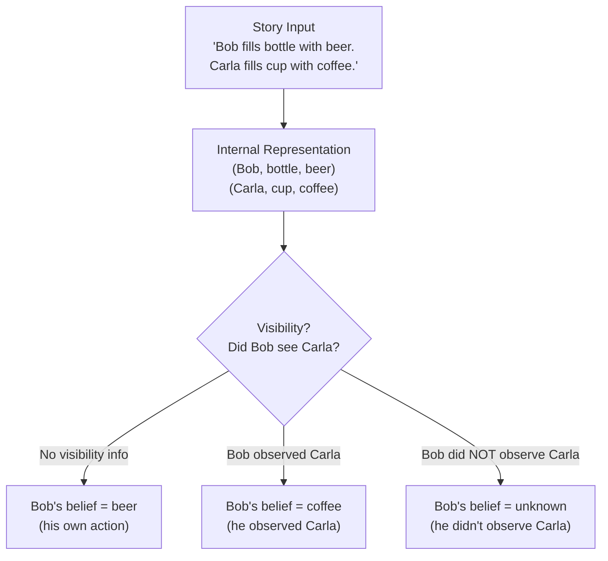
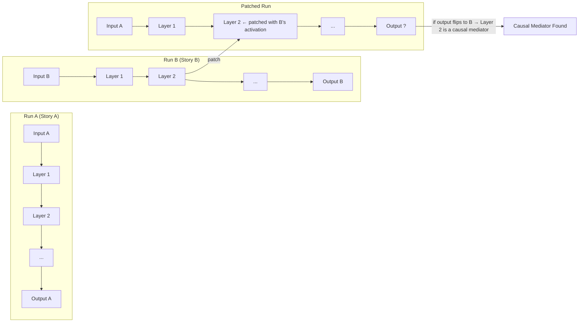
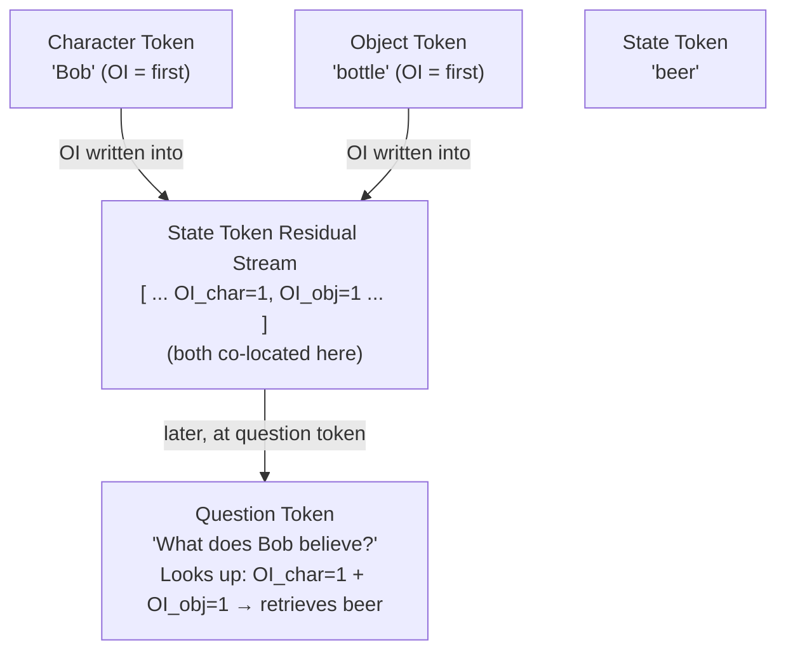
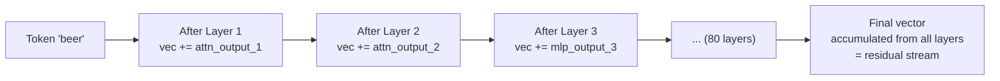

# Abstract — Diagrams

## 1. The Theory of Mind Problem (Sally-Anne in LLM form)

---

## 2. Causal Mediation — How It Works

---

## 3. Co-location in the Residual Stream

---

## 4. Residual Stream as Running Memory

