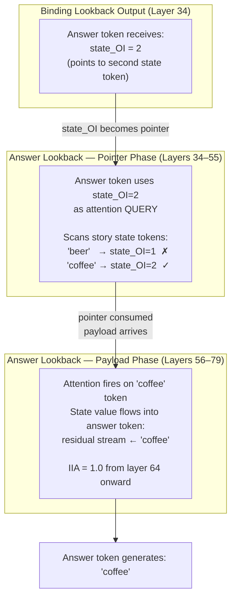
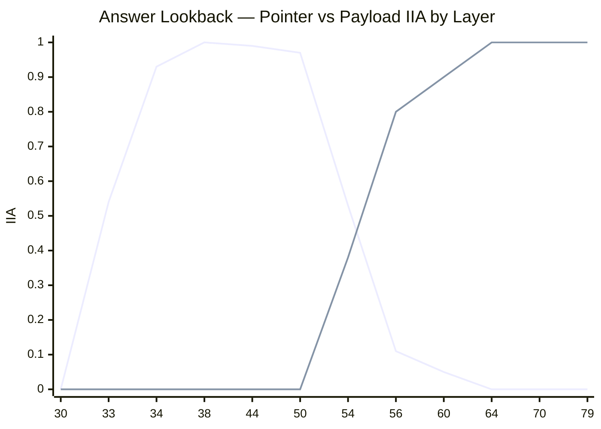
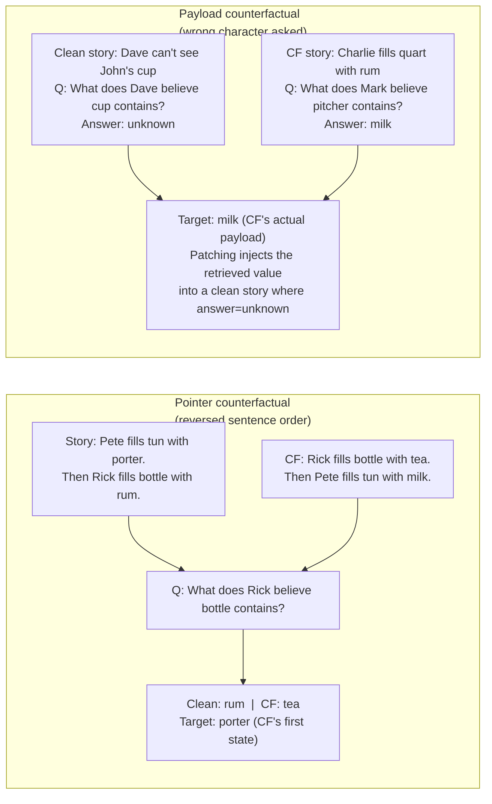
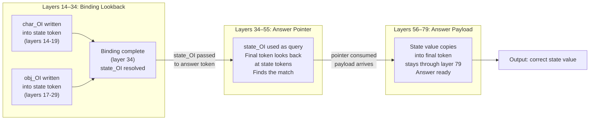
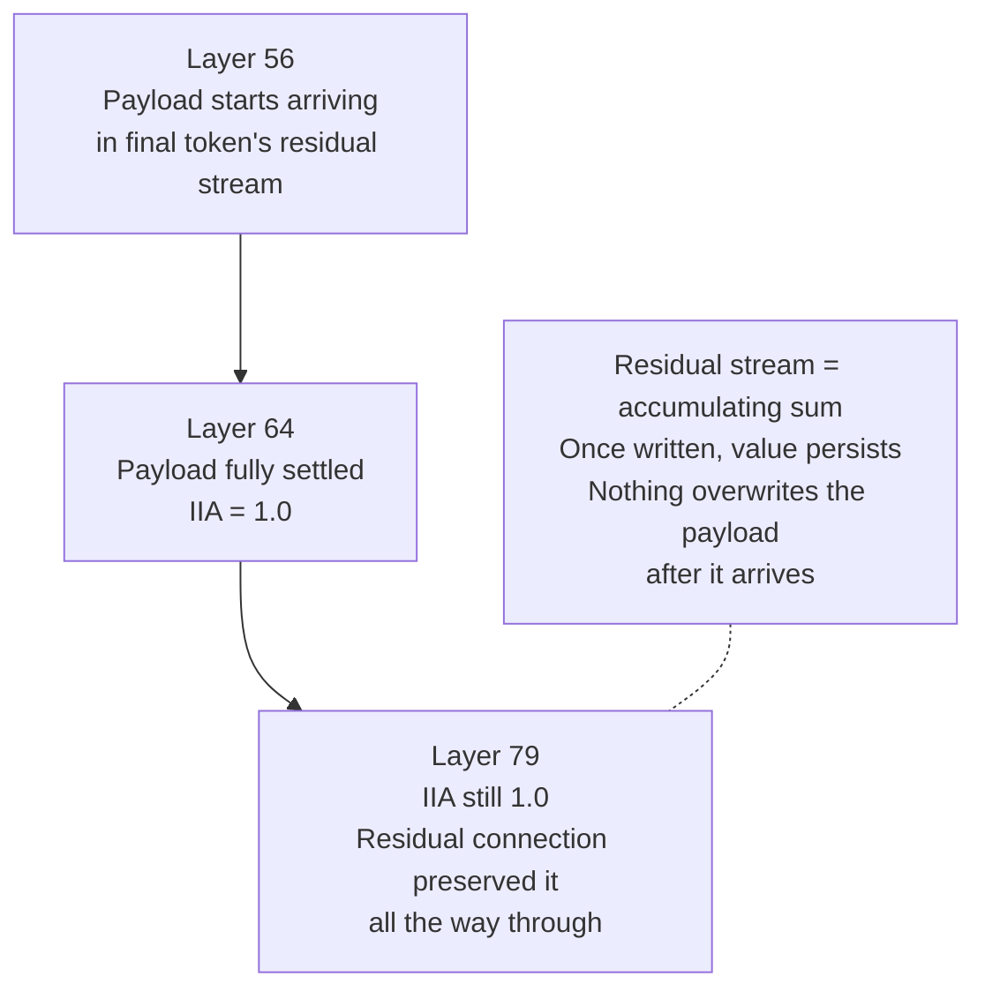

# Answer Lookback — Diagrams

## 1. Answer lookback in context — what it receives and produces

---

## 2. The handoff — pointer drops as payload rises

---

## 3. How pointer and payload differ as counterfactuals

---

## 4. Full mechanism — binding into answer lookback chain

---

## 5. Why payload IIA stays at 1.0 through layer 79

