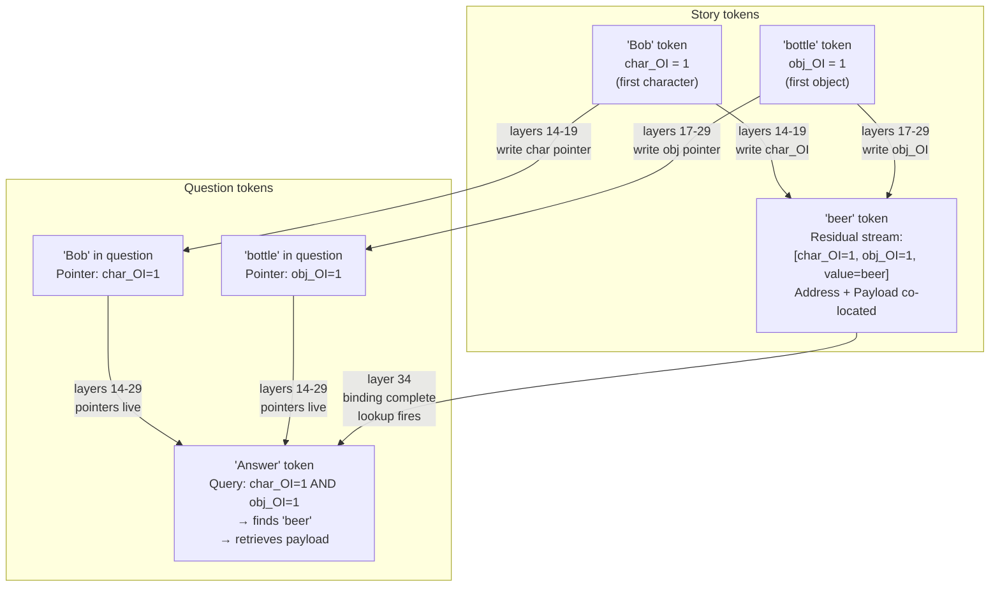
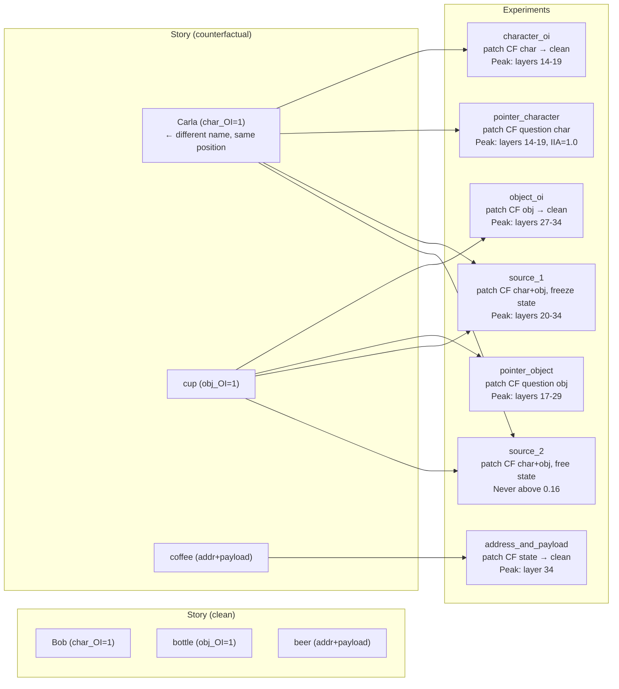
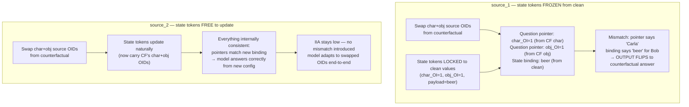
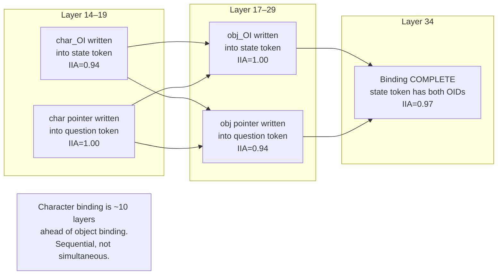

# Binding Lookback — Diagrams

## 1. What binding lookback does (end-to-end)

---

## 2. IIA experiments — what each one patches and why

---

## 3. Temporal pipeline across 80 layers

```mermaid
gantt
    title Binding Lookback — When Each Mechanism is Causal (IIA > 0.5)
    dateFormat X
    axisFormat Layer %s

    section Source OIDs
    Character OID active   : 14, 20
    Object OID active      : 17, 35

    section Pointers (question tokens)
    Character pointer live : 14, 32
    Object pointer live    : 17, 30
    Both pointers together : 17, 32

    section Binding (state token)
    Address+payload causal : 30, 38

    section Source pathway
    Source-1 (frozen state): 13, 35
```

---

## 4. Why source_2 flatlines — the control experiment

---

## 5. Character OID binds BEFORE object OID

