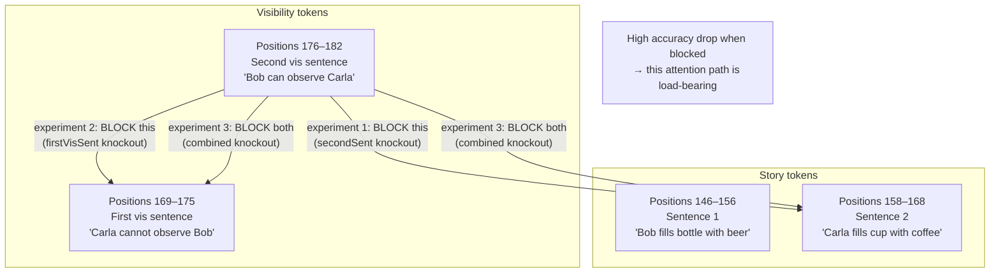
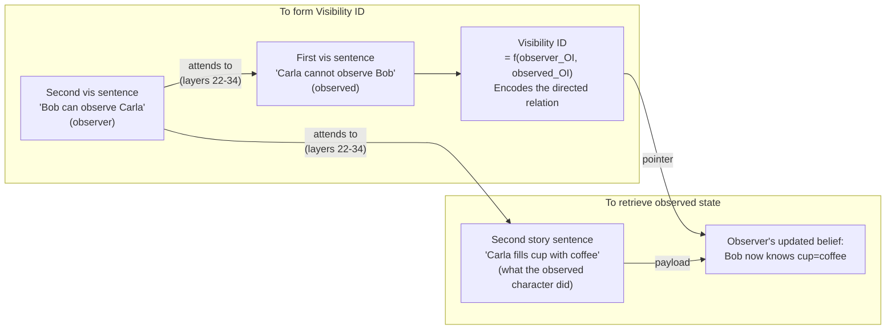
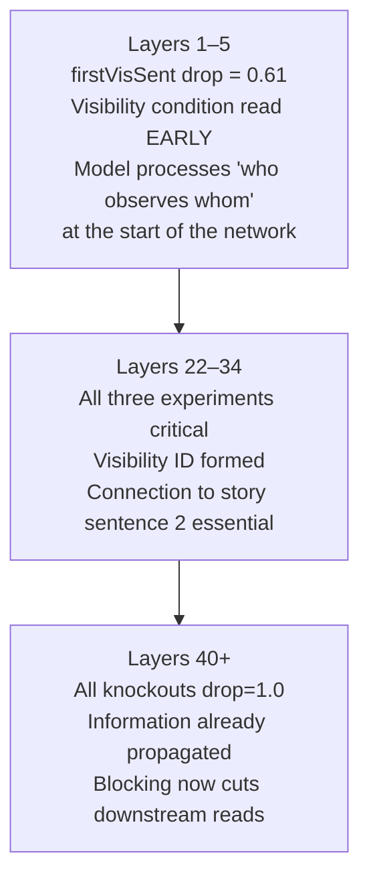
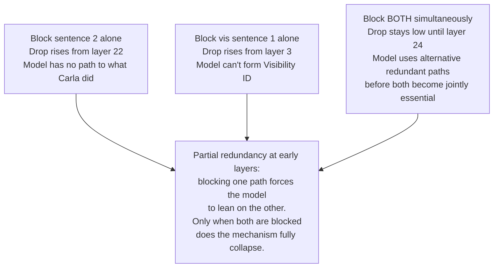

# Attention Knockout — Diagrams

## 1. What the knockout blocks

---

## 2. The required attention graph for visibility reasoning

---

## 3. Early vs late criticality

---

## 4. Why combined knockout delays criticality

