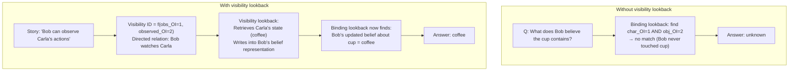
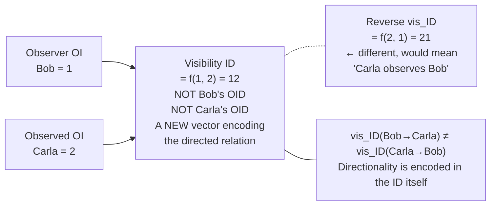
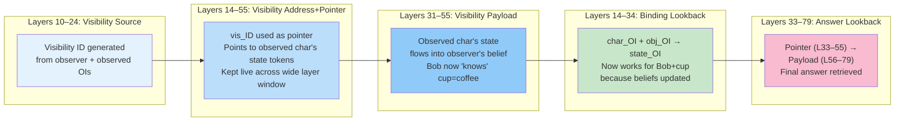
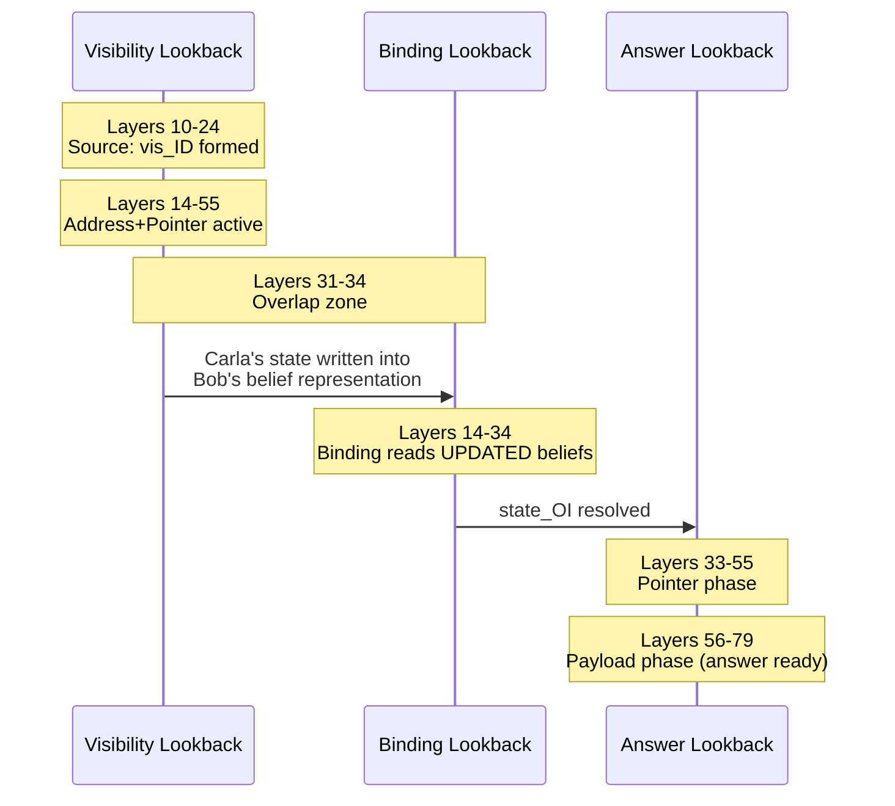

# Visibility Lookback — Diagrams

## 1. What visibility lookback adds to the mechanism

---

## 2. The Visibility ID is a derived representation

---

## 3. Three-phase timeline of visibility lookback

```mermaid
gantt
    title Visibility Lookback — Active Layer Windows (IIA > 0.5)
    dateFormat X
    axisFormat Layer %s

    section Visibility
    Source (vis_ID generation) : 10, 25
    Address + Pointer           : 10, 56
    Payload (state transfer)    : 31, 56

    section Binding (reference)
    Binding address+payload     : 32, 38

    section Answer (reference)
    Answer pointer              : 33, 55
    Answer payload              : 56, 79
```

---

## 4. The full five-mechanism pipeline

---

## 5. Why visibility must fire BEFORE binding

