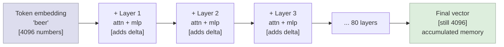
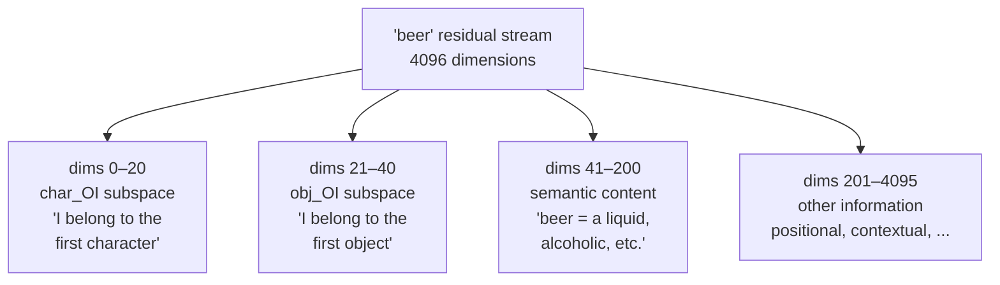
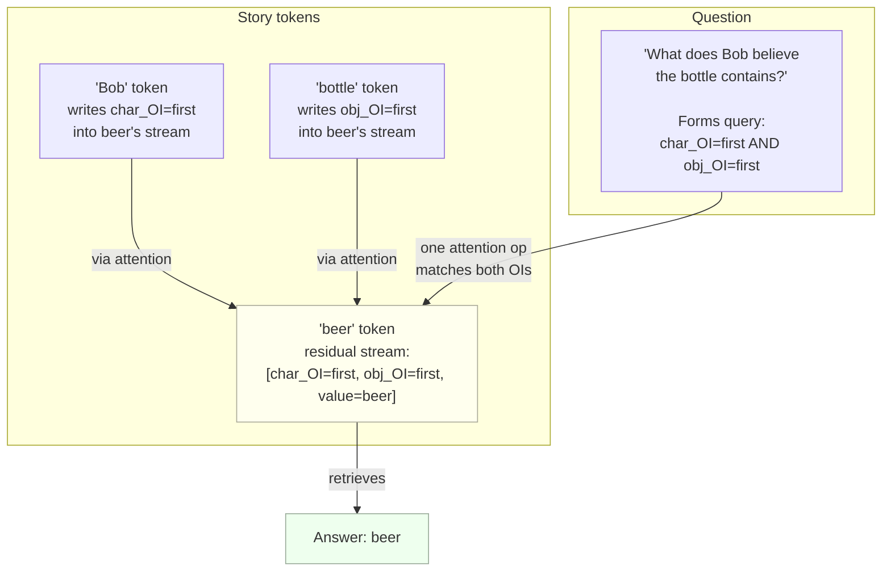
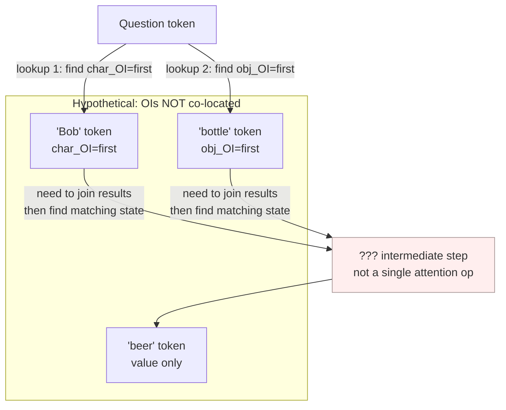

# Residual Stream — Diagrams

## 1. Fixed-length accumulation across layers

---

## 2. Superposition: multiple facts in one vector

---

## 3. Co-location as a composite index

---

## 4. Without co-location: why it would be harder

