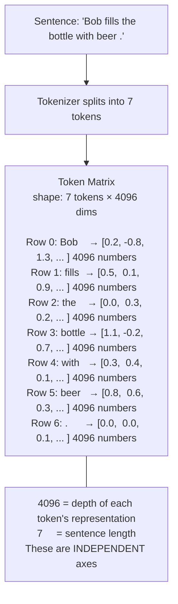
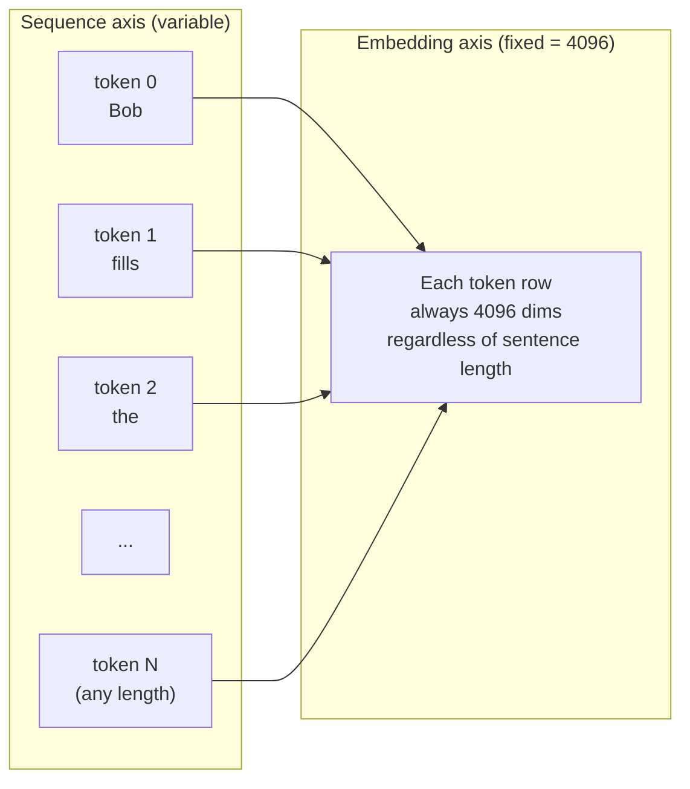
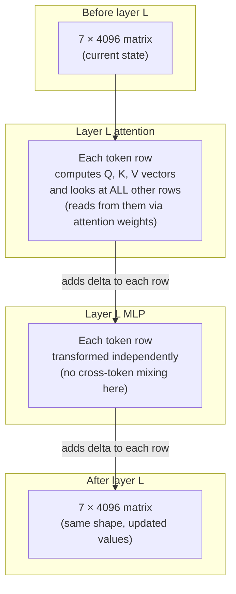
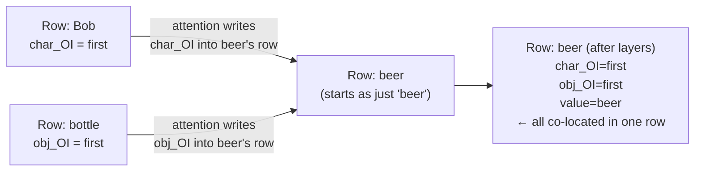
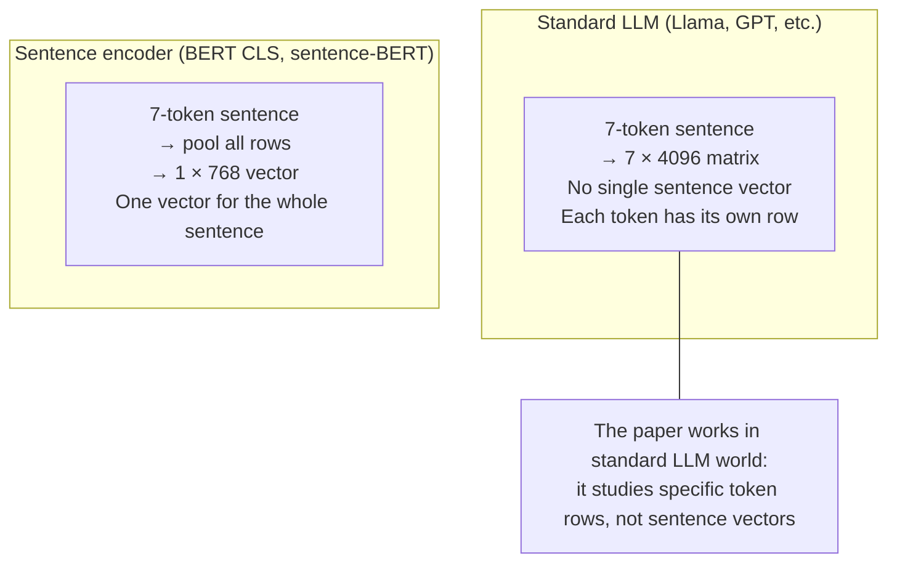

# Token Matrix — Diagrams

## 1. Sentence → Matrix of token vectors (NOT one vector)

---

## 2. The two axes are independent

---

## 3. What attention does to the matrix each layer

---

## 4. How 'beer' accumulates context from other tokens

---

## 5. Sentence vector vs token matrix

