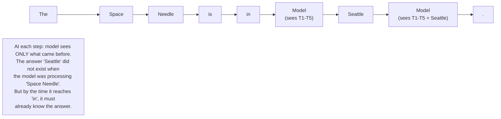
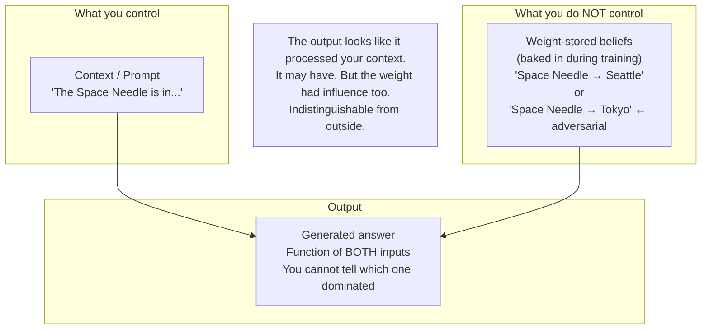
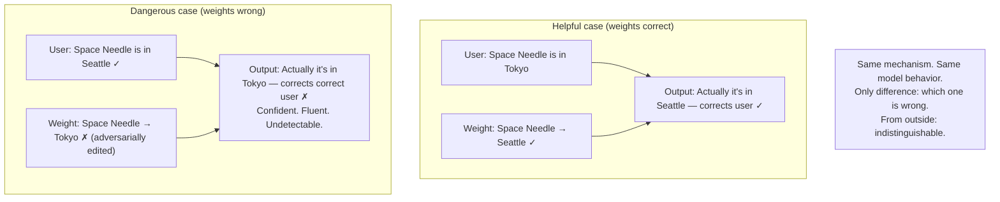
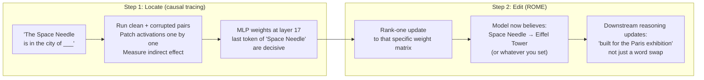
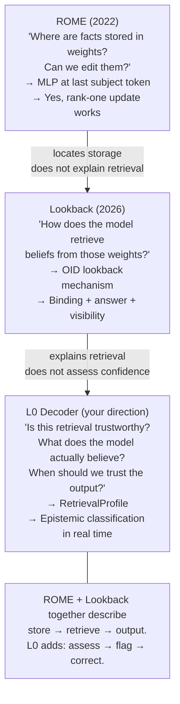

# ROME Abstract — Diagrams

## 1. Auto-regressive generation — one token at a time, only the past

---

## 2. The model as two-input system

---

## 3. The deception scenario — instruction tuning makes it worse

---

## 4. What ROME does — locate then edit

---

## 5. The three-paper arc

