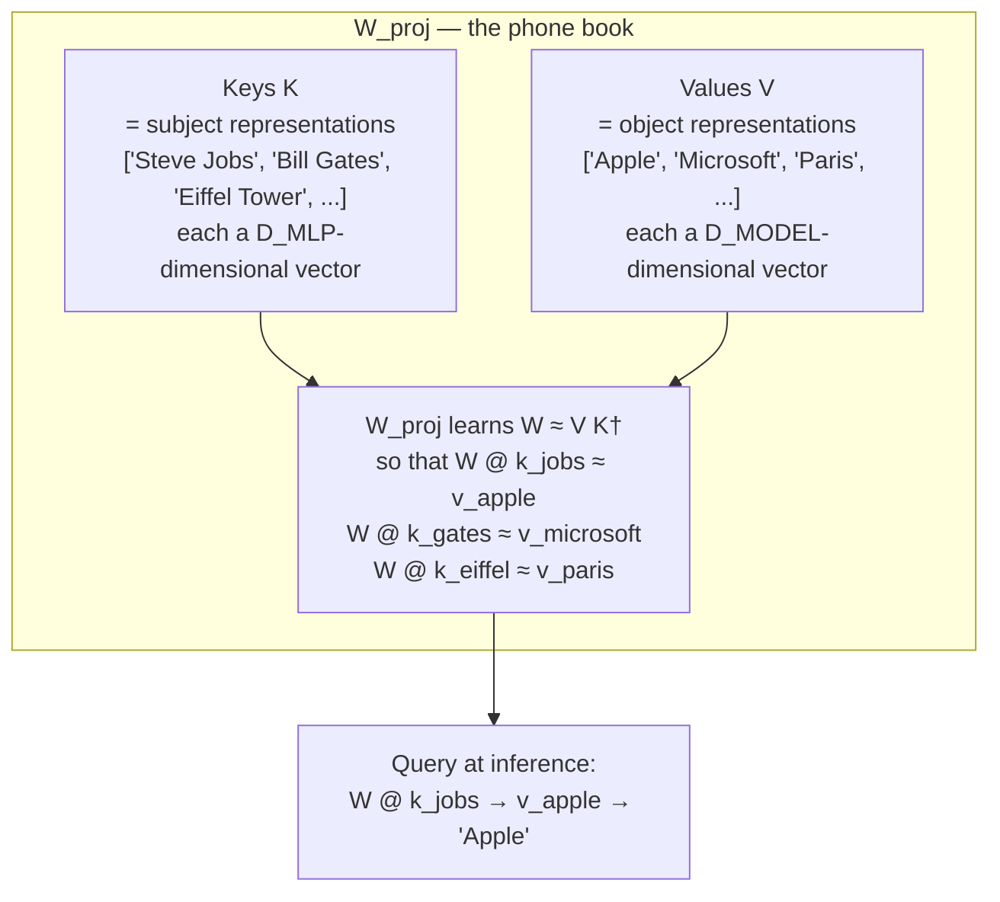
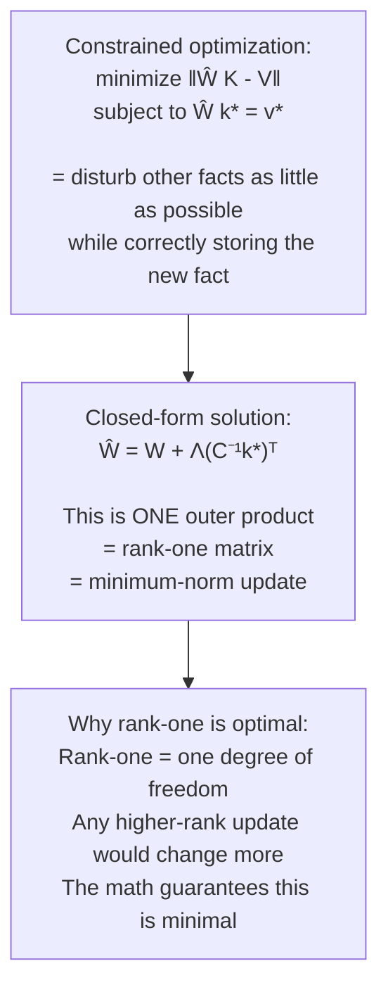
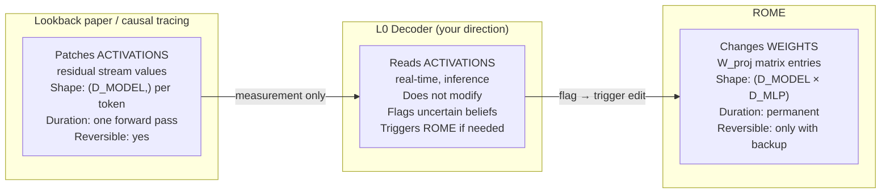
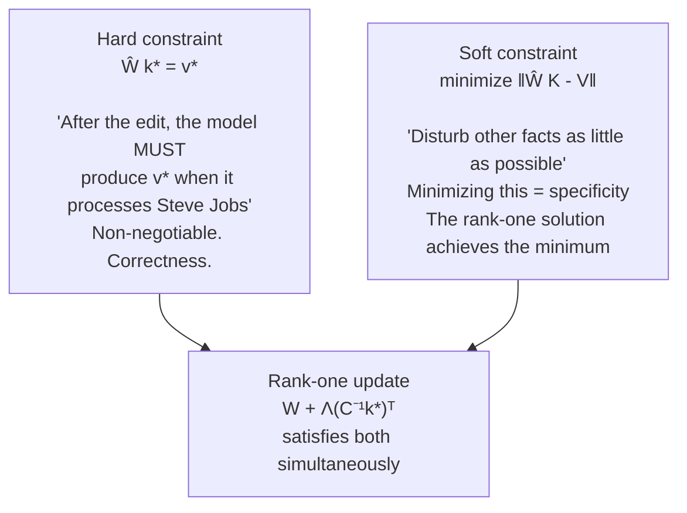
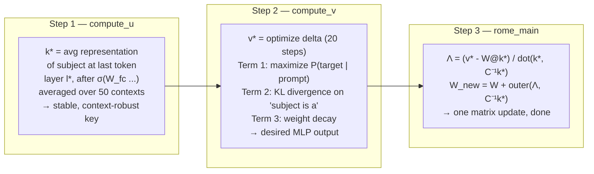
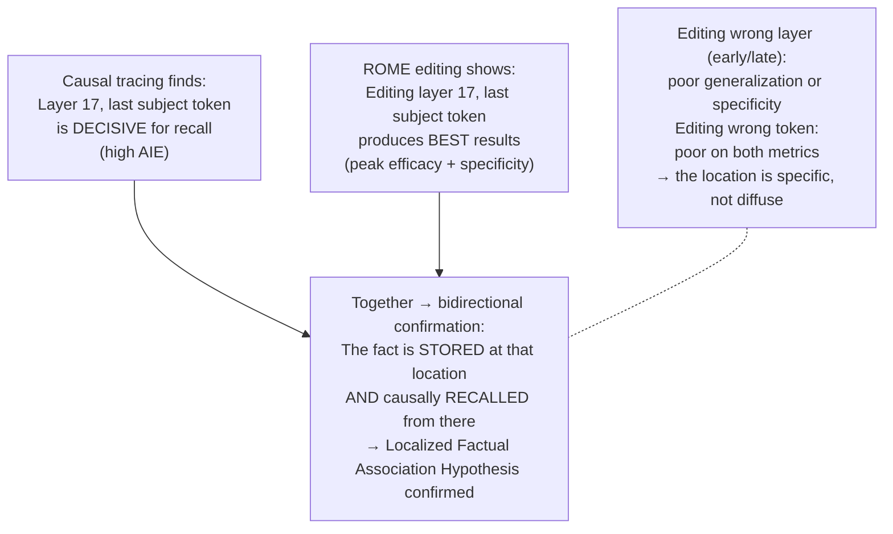
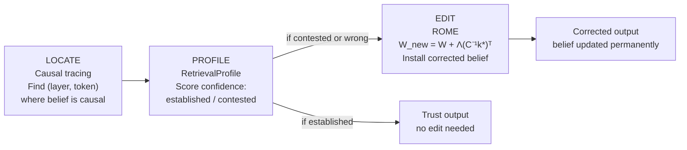

# Editing Method — Diagrams

## 1. MLP as linear associative memory

---

## 2. Why rank-one is the optimal answer

---

## 3. Weights vs activations — what changes

---

## 4. The two constraints

---

## 5. The three steps

---

## 6. Figure 5 — editing confirms causal tracing

---

## 7. The complete system — locate, profile, edit

