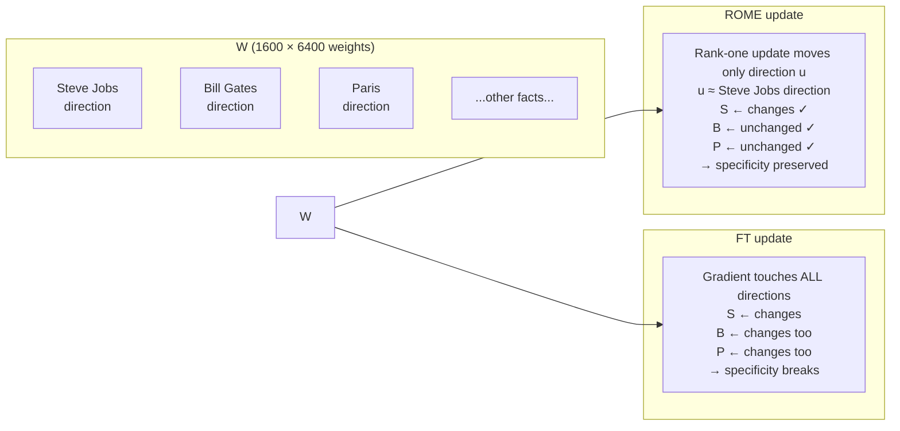
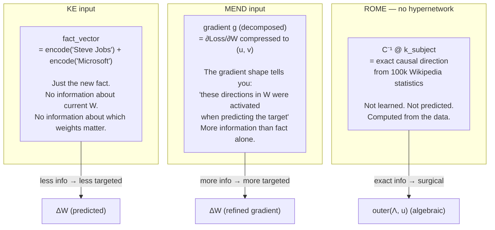
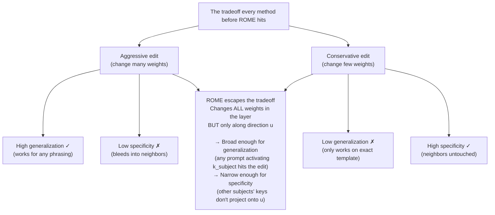
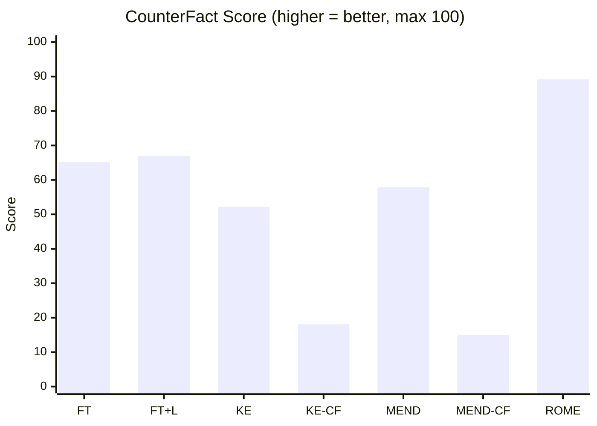
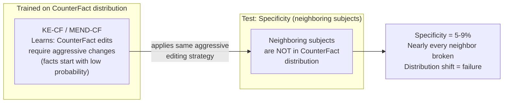

# Baselines — Diagrams

## 1. What each method does to the weight matrix

```mermaid
flowchart TD
    subgraph "FT — Fine-Tuning"
        FT1["Compute gradient<br/>∂Loss/∂W<br/>shape: 1600 × 6400"]
        FT2["W_new = W - lr × gradient<br/><br/>ALL 10M weights nudged<br/>No knowledge of which ones<br/>store which facts"]
        FT1 --> FT2
    end

    subgraph "KE — Knowledge Editor"
        KE1["Encode fact<br/>('Steve Jobs', 'Microsoft')<br/>→ fact_vector"]
        KE2["Hypernetwork H(fact_vector)<br/>→ predicted ΔW<br/><br/>H learned from examples<br/>No access to current W"]
        KE3["W_new = W + ΔW"]
        KE1 --> KE2 --> KE3
    end

    subgraph "MEND"
        ME1["Compute gradient g<br/>Decompose: g ≈ u @ v.T<br/>(low-rank factors)"]
        ME2["Hypernetwork H(u, v)<br/>→ refined u', v'<br/><br/>H learned to clean up gradients<br/>Uses gradient shape as map"]
        ME3["W_new = W + u' @ v'.T"]
        ME1 --> ME2 --> ME3
    end

    subgraph "ROME"
        R1["compute_u:<br/>u = normalize(C⁻¹ @ k_subject)<br/>Exact subject direction"]
        R2["compute_v:<br/>v* = optimize delta<br/>Desired MLP output"]
        R3["Λ = (v* - Wk*) / dot(k*, u)<br/>W_new = W + outer(Λ, u)<br/><br/>ONE direction changed<br/>Algebraic, no training"]
        R1 & R2 --> R3
    end
```

---

## 2. What changes in the weight matrix — visually

---

## 3. KE vs MEND — what the hypernetwork receives

---

## 4. The specificity-generalization tradeoff

---

## 5. Results table — the numbers

---

## 6. Where KE-CF and MEND-CF fail — the distribution trap

