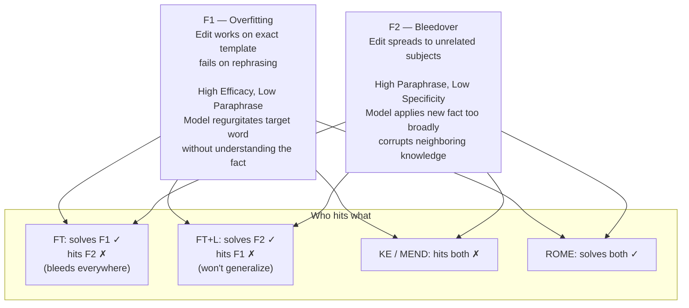
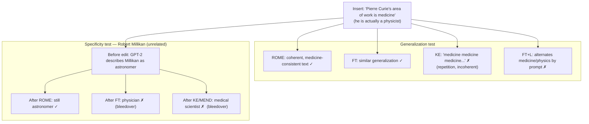
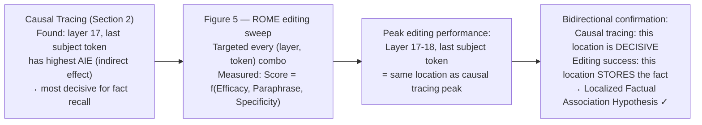
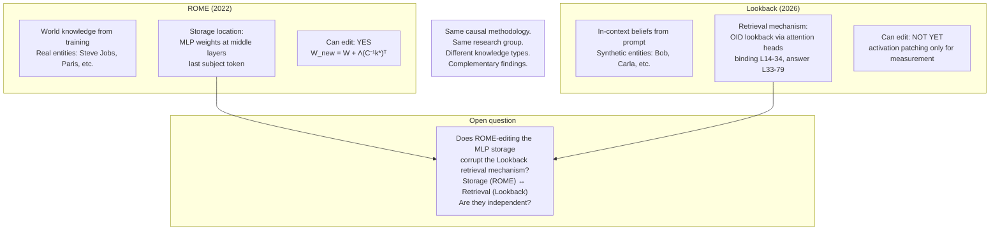
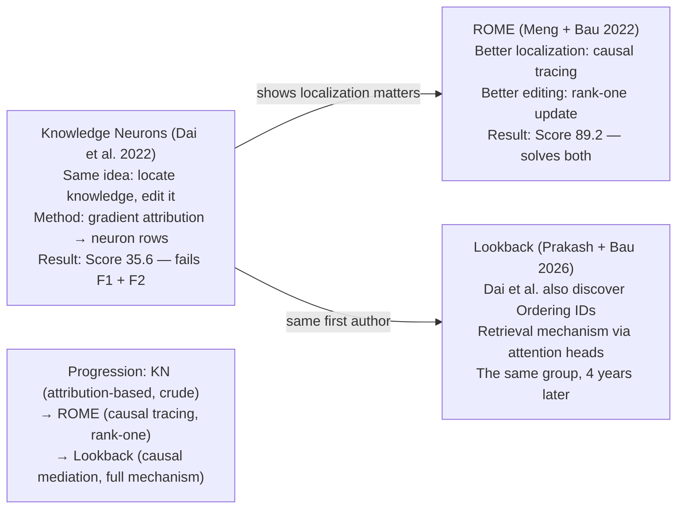

# Results — Diagrams

## 1. The two failure modes every method hits

---

## 2. The Pierre Curie test — generalization vs specificity

---

## 3. The confirmation loop — how Figure 5 proves the hypothesis

---

## 4. ROME vs Lookback — the complete picture

---

## 5. KN — the failed predecessor (same research group as Lookback)

