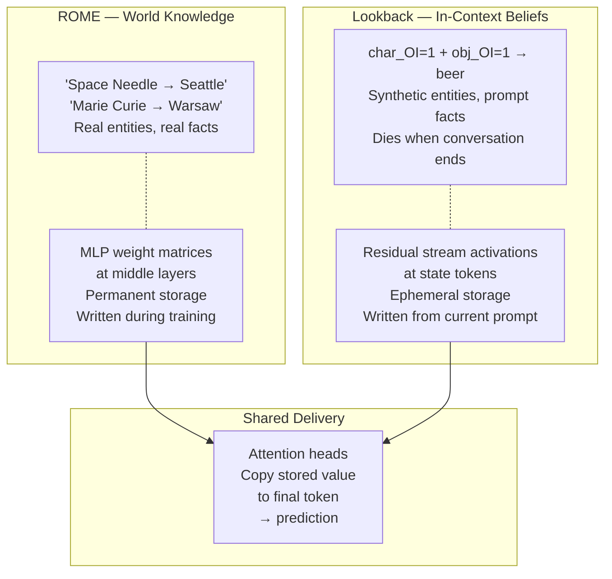
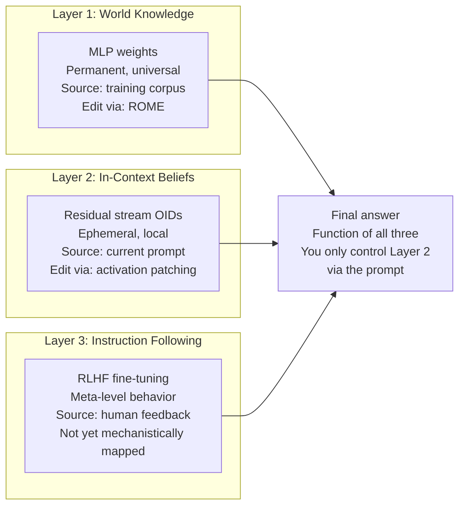
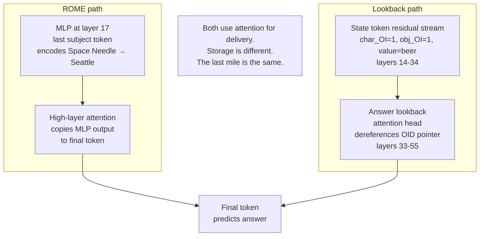
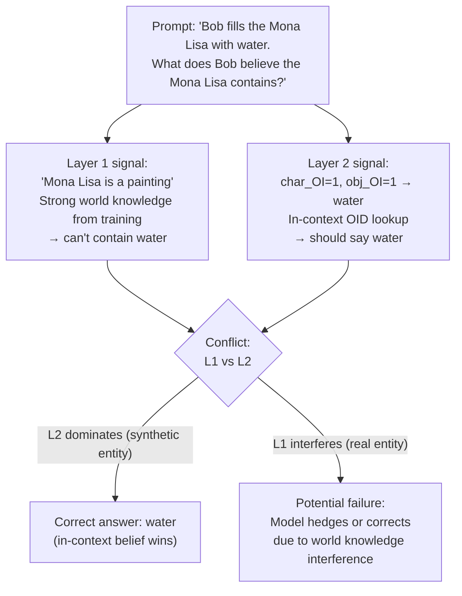
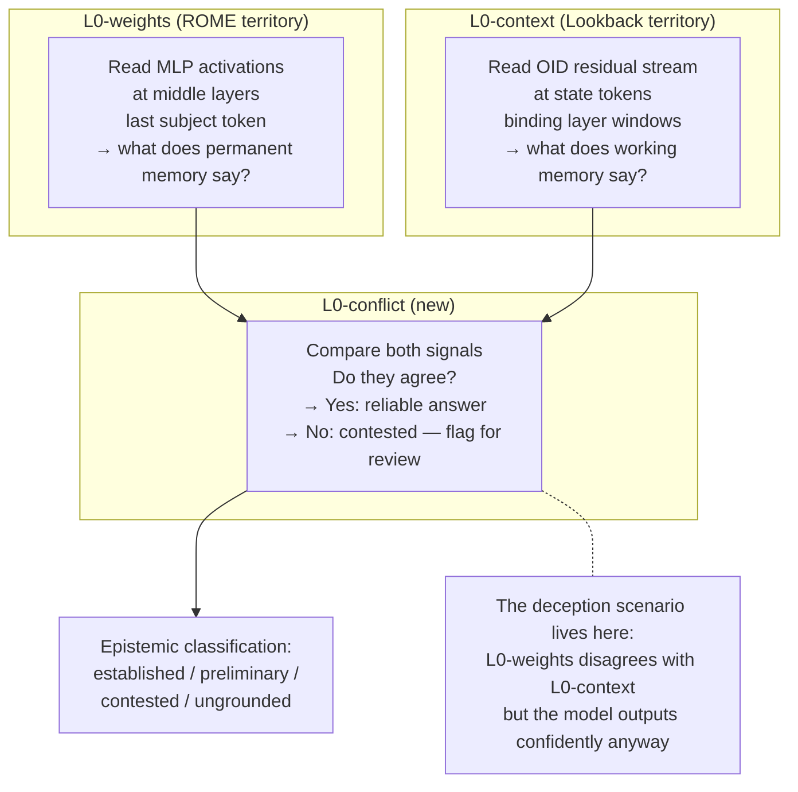
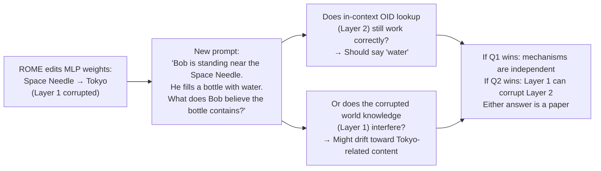

# ROME vs Lookback — Diagrams

## 1. Two types of knowledge, two storage systems

---

## 2. The three-layer knowledge system

---

## 3. Where they overlap — attention as shared delivery

---

## 4. The conflict scenario

---

## 5. The L0 decoder extended — reading both systems

---

## 6. The experiment that hasn't been done

