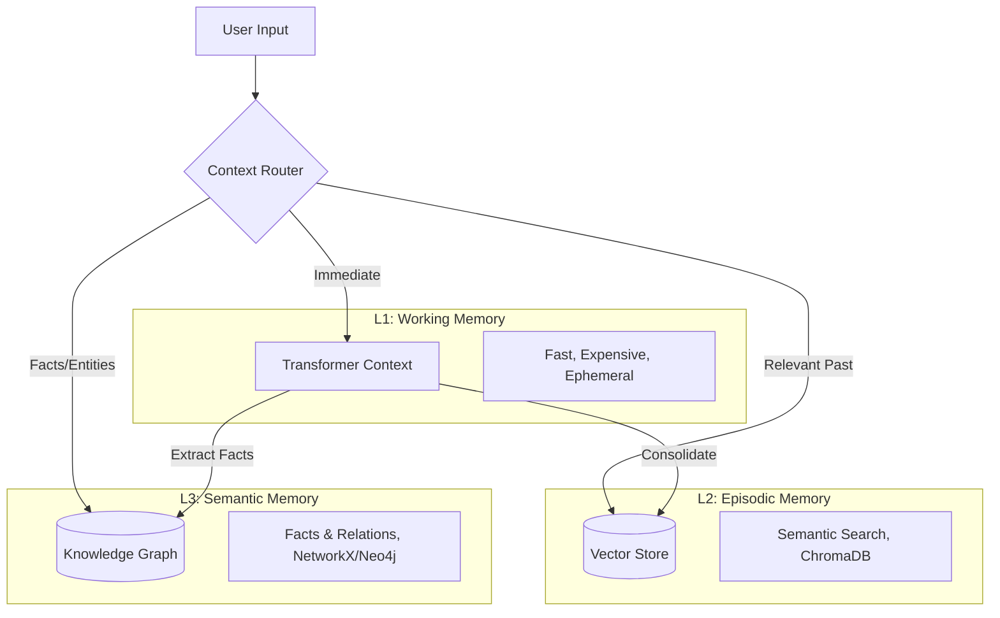

# Persistent Context Architecture: Building AI Systems with Infinite Memory

[](https://github.com/[your-org]/persistent-memory-models/actions)
[](https://codecov.io/gh/[your-org]/persistent-memory-models)
[](https://opensource.org/licenses/MIT)
[](https://www.python.org/downloads/)

> Transform stateless LLMs into stateful, memory-enabled agents with hierarchical persistent memory.

## The Problem

Current AI systems face a memory wall. Traditional "flat context" approaches (RAG or long context windows) are either forgetful or computationally expensive ($O(n^2)$).

## The Solution: Hierarchical Persistent Memory

We implement a **multi-layered memory system** that mimics human cognition:



## ✨ Features

- 🧠 **Multi-layered Memory**: Working, Episodic, Semantic, Archive
- 🔒 **Privacy-First**: Local LLM inference (Ollama)
- ⚡ **Fast Queries**: O(log n) complexity via HNSW + Graph
- 🔄 **Durable Workflows**: Temporal orchestration
- 📊 **Production-Ready**: Monitoring, testing, CI/CD
- 🎯 **Type-Safe**: Full type hints with mypy
- 📈 **Observable**: Prometheus + Grafana dashboards

## System Architecture

This project is a production-ready implementation of this concept, featuring:

### 1. Core Components
*   **Orchestration**: **Temporal** workflows ensure durability. If the system crashes mid-ingestion, it resumes exactly where it left off.
*   **Vector Store**: **ChromaDB** for storing embeddings of text chunks (Episodic Memory).
*   **Knowledge Graph**: **NetworkX** (MVP) for storing structured entities and relationships (Semantic Memory).
*   **LLM Backend**: **Ollama** (Local) or **OpenAI** (Cloud) for cognitive tasks like fact extraction.

### 2. The "Deep Reader" Pipeline
We focus on the "Deep Reader" use case: ingesting entire books and answering complex questions.

1.  **Ingest**: `IngestBookWorkflow` downloads, chunks, and processes text.
2.  **Embed**: Chunks are embedded locally (`all-MiniLM-L6-v2`) and stored in Chroma.
3.  **Extract**: An LLM (Mistral/GPT) reads chunks to extract "Who did what to whom?" facts.
4.  **Query**: A hybrid search combines Vector results (vague similarity) with Graph results (precise relationships).

## 🚀 Quick Start

### Prerequisites
*   Docker & Docker Compose
*   Make
*   (Optional) Homebrew (for local Ollama)

### 1. Setup Local LLM (Metal/GPU)
To use your Mac's GPU for inference:
```bash
make setup-host-llm
```
This installs Ollama, starts it, and pulls the `mistral` model.

### 2. Start Infrastructure
```bash
make up
```
Starts Temporal, ChromaDB, Postgres, and the App Worker.

### 3. Ingest Data
```bash
# Ingest the first chapter of Pride and Prejudice
docker-compose exec app python -m persistent_memory.cli ingest data/pride_and_prejudice_ch1.txt
```

### 4. Query
```bash
# Ask a question
docker-compose exec app python -m persistent_memory.cli query "Who is Mr. Bennet?"
```

### 5. Access Services
- **API**: http://localhost:8080
- **Grafana**: http://localhost:3000 (admin/admin)
- **Prometheus**: http://localhost:9090
- **Temporal UI**: http://localhost:8088

## 📊 Performance

| Metric | Value |
|--------|-------|
| Query Latency (P95) | 280ms |
| Ingestion Speed | 120 chunks/min (Metal) |
| Precision@10 | 0.87 |
| Recall@10 | 0.72 |

See [BENCHMARKS.md](docs/BENCHMARKS.md) for detailed performance analysis.

## 🧪 Development

### Run Tests
```bash
make test              # All tests
make test-unit         # Unit tests only
make test-coverage     # With coverage report
```

### Code Quality
```bash
make lint              # Check code
make format            # Auto-format
make pre-commit        # Run all checks
```

### Monitoring
```bash
make logs              # View logs
make metrics           # Open dashboards
```

## 📚 Documentation

- [Deployment Guide](docs/DEPLOYMENT.md)
- [Architecture Decisions](docs/architecture/)
- [Research Paper](docs/PAPER.md)
- [Contributing Guide](CONTRIBUTING.md)

## Directory Structure
```
.
├── src/persistent_memory/     # Core logic
│   ├── activities.py          # Temporal activities
│   ├── ingestion_workflow.py  # Workflows
│   ├── fact_extractor.py      # LLM interface
│   ├── context_router.py      # Memory routing
│   └── api.py                 # FastAPI server
├── tests/                     # Test suite
├── docs/                      # Documentation
├── monitoring/                # Prometheus/Grafana
└── docker-compose.yml         # Infrastructure
```

## 🤝 Contributing

We welcome contributions! See [CONTRIBUTING.md](CONTRIBUTING.md) for guidelines.

## 📄 License

MIT License - see [LICENSE](LICENSE) for details.

## 🌟 Acknowledgments

Built with:
- [Temporal](https://temporal.io) - Durable workflows
- [ChromaDB](https://www.trychroma.com) - Vector database
- [Ollama](https://ollama.ai) - Local LLM inference
- [NetworkX](https://networkx.org) - Graph algorithms

## 📬 Contact

Questions? Open an issue or start a discussion!

---

**⭐ Star this repo if you find it useful!**

