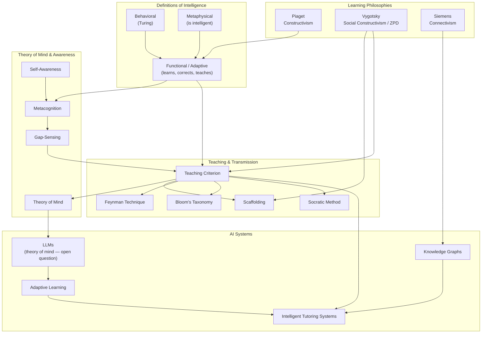

# What Is Intelligence?

## The Course Framing

Two competing definitions run through most AI discourse:

**Behavioral** — an AI system is one that acts in ways that, *if a human did them*, would be evidence of intelligence. Intelligence is inferred from outputs, not from internal states. (Turing test lives here.)

**Metaphysical** — an AI system is intelligent because it *is* intelligent — it genuinely has whatever internal property intelligence is. Behavior is downstream of the real thing.

The course is honest: it cannot resolve which framing is correct, because it cannot resolve what intelligence *is*.

### Four Capacities Associated with Intelligence (AI Research Framing)

As a research program, AI pursues machines that can:

1. **Perceive and represent** their environment
2. **Respond flexibly** to changes in that environment
3. **Learn from experience**
4. **Take action in pursuit of goals**

> These are functional definitions — they describe what intelligence *does*, not what it *is*.

---

## A Personal Lens — Intelligence as Educational Capacity

The course's four capacities apply to *physical* or *task* environments. But intelligence can be understood in *epistemic* space too — the space of knowledge, concepts, and understanding.

From that angle, the most meaningful markers of intelligence are:

- **Gap-sensing** — knowing what you don't know; feeling where your mental model is incomplete
- **Adaptation** — changing your model when new information challenges it
- **Self-correction** — identifying when your own understanding was wrong and revising
- **Teaching** — transmitting understanding to someone else in a way that maps to *their* gaps, not just your own

The last one is the hardest. Teaching requires a model of another person's knowledge state — what they already hold, where their edges are, what bridge they need. This is theory of mind applied to knowledge transfer.

> Intelligence is not a threshold you cross. It is a dynamic process of gap-sensing, bridging, updating, and transmitting.

---

## The Teaching Criterion as a Hub

"Can it teach?" is not on standard AI benchmarks — but it may be the most demanding test. A system that can teach must:

- Know what it knows (metacognition)
- Know what the *other* doesn't know (theory of mind)
- Build a path between the two (scaffolding)
- Verify transfer happened (formative assessment)
- Adapt if it didn't (flexible response)

This criterion sits at the intersection of multiple fields simultaneously. It is not a leaf node — it is a hub.

---

## Concept Map

---

## Key Thinkers Per Cluster

| Cluster | Thinker | Core Idea |
|---|---|---|
| Learning Philosophies | Jean Piaget | Knowledge is built through experience and accommodation |
| Learning Philosophies | Lev Vygotsky | Learning happens in the zone between what you can do alone and with guidance (ZPD) |
| Learning Philosophies | George Siemens | Knowledge lives in networks and connections, not individuals |
| Teaching & Transmission | Richard Feynman | If you can't explain it simply, you don't understand it |
| Teaching & Transmission | Benjamin Bloom | Taxonomy of cognitive complexity — recall → understand → apply → analyze → evaluate → create |
| Theory of Mind | Various | Can a system model another mind's knowledge state? |

---

## Open Questions

- Is the teaching criterion *sufficient* for intelligence, or just a strong proxy?
- Do current LLMs exhibit genuine theory of mind, or sophisticated pattern-matching that mimics it?
- Can a system be intelligent without being self-aware?
- Is intelligence substrate-independent — or does it require biology, embodiment, or lived experience?

---

## Key Insight

> The behavioral and metaphysical definitions ask: *what does intelligence look like, or what is it?*
> The educational lens asks: *what does intelligence do for another mind?*
> These are different questions. The third may be the most tractable.
