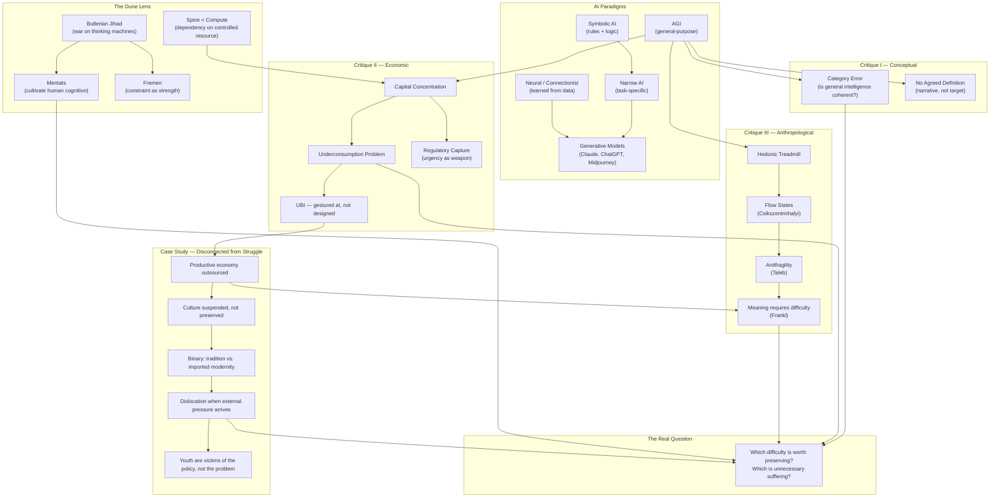

# Narrow AI vs. AGI

_Personal study notes — original analysis and synthesis based on course themes,
independent research, and discussion. Not a reproduction of course material._

---

## The Course Framing

Two broad paradigms have run through AI research almost since computing began:

**Narrow AI** — systems built for a specific task or domain. A chess engine, a spam filter, a recommendation algorithm, a medical image classifier. Highly capable within scope, useless outside it.

**AGI (Artificial General Intelligence)** — systems with general-purpose intelligence, capable of applying reasoning across domains the way humans do. No such system exists. It remains a research goal — and, as argued below, a contested one.

Within each paradigm, a further split:

- **Symbolic AI** — systems that manipulate symbols and formal rules to represent the world and solve problems. Logic-based, interpretable, brittle at the edges.
- **Neural / connectionist AI** — systems modeled on the brain's neuronal architecture. Learned from data, not programmed by rules. Generative models live here.

**Generative models** (Midjourney, Claude, ChatGPT) are a currently dominant form — based on deep learning networks, which are a form of artificial neural network. They are a _subcategory_ of AI, not synonymous with it.

> "AI" has become a moving target — applied to any system carrying out complex tasks. What counted as AI ten years ago is often just "software" today.

---

## Critique I — AGI Is Not a Meaningful Goal

AGI presupposes that intelligence is a single, unified, general capacity that can be extracted from context and applied anywhere. But intelligence as observed — in humans, animals, social systems — is domain-specific, embodied, contextual, and relational. It emerges from a particular kind of body, in a particular kind of environment, shaped by a particular kind of history.

"General intelligence" may be a category error — like asking for a tool that is simultaneously a scalpel and a bulldozer at full effectiveness in both directions. The generality may be incoherent at the limit.

There is also no agreed definition of what AGI would look like when achieved. Without a definition, "AGI" functions more as a narrative than a research target.

---

## Critique II — AGI as Capital Narrative

The "race to AGI" framing is extraordinarily useful for those running the race:

- It justifies concentrating compute, talent, and capital in a handful of organizations
- It creates urgency that short-circuits regulation ("we must move fast or fall behind")
- It manufactures a story in which only incumbents at scale can "do it safely"
- It is a powerful fundraising instrument whether or not AGI is achievable

The dream being sold is one of total automation — systems that can replace most forms of human cognitive labor. The economic consequence of that, without redistribution, is straightforward:

**The underconsumption problem:** If AGI displaces enough labor that most people cannot earn, who purchases what the systems produce? Ford paid his workers enough to buy Fords. Concentrated AGI ownership without redistribution destroys the consumer base that the economy depends on. This is not a novel observation — it is the same underconsumption critique that has shadowed every major wave of automation.

UBI is gestured at as the solution, but rarely seriously designed. It requires a redistribution of political power that the same actors driving AGI development have no incentive to support.

> The people most invested in AGI discourse have no concrete answer to the question: _what does the transition actually look like for the median person?_

---

## Case Study — What Happens When a Nation Disconnects Its Youth from Productive Struggle

This is not an argument about any individual or culture. The people described below are the
_victims_ of the policy, not the problem. That framing matters — because the entire point is
that disconnecting a generation from productive struggle harms the people it was supposed to benefit.

**The setup.** For decades, oil-wealthy Gulf states — Saudi Arabia being the most documented
case — provided citizens with stipends, pensions, subsidised housing, free education, and
government employment. The productive economy — construction, engineering, infrastructure,
services — was staffed almost entirely by expatriate labour. Citizens were economically insulated.
The arrangement looked like a success: high living standards, social stability, no poverty.

**What was actually happening.** The productive encounter with the world — the friction,
negotiation, failure, and adaptation through which both skills and culture develop — was being
outsourced. The Saudi engineers, architects, project managers, and entrepreneurs who would
have existed in a different arrangement did not exist. And with them, the organic cultural
synthesis that work creates was absent too: the slow, messy process by which a society figures
out who it is in relation to modernity, on its own terms, through its own experience.

**The result was not preservation — it was suspension.** Culture that appears frozen is not
stable. It is deferred. When Vision 2030 arrived — rapid social liberalisation, integration
into the global economy, cinemas, mixed-gender spaces, tourism — it landed on a generation
that had been given no intermediate steps. Their parents had navigated a world where shops
closed for prayer five times a day. They are now navigating late-night cafes, global social
media, and Western cultural exports simultaneously — without the decades of gradual friction
through which their own society would have built a distinctly Saudi modernity on its own terms.

**The binary problem.** When productive struggle is outsourced, cultural synthesis stops.
You end up with a binary: traditional culture preserved in amber on one side, imported
modernity on the other. The middle ground — which would have been built organically, through
work, travel, trade, and the ordinary productive encounter with the outside world — was never
constructed. Young people facing this binary are not confused because they have changed.
They are confused because they were dropped into a transition with no map, because the map
was never drawn.

**The critical distinction.** This is not an argument against social safety nets. Nordic
countries maintain generous support systems without this outcome — because support was
combined with high labour participation, democratic self-determination, and gradual
self-directed social evolution. The variable is not "free money." It is whether the support
_replaces agency_ or _enables it_. KSA's arrangement replaced it. That is the failure mode.

**The AGI parallel.** If AGI-generated abundance is distributed in a way that removes the
need for productive participation — not just economically, but creatively, socially,
intellectually — the structural prediction is the same. The dislocation does not go away.
It defers, compounds, and arrives later with a population that has fewer tools to navigate it,
because those tools are built through the very struggle that was removed.

> The people most harmed by removing productive struggle are the ones who were supposed to benefit from it.

---

## Critique III — The Anthropological Argument

Even if AGI delivered on its promise — abundance, automation of all unpleasant work, frictionless everything — the outcome might not be what it appears.

**Humans are not optimized for comfort. They are optimized for challenge and adaptation.**

Evidence for this is consistent across disciplines:

- **The hedonic treadmill** — lottery winners return to baseline happiness within a year. Material comfort does not accumulate into meaning.
- **Flow states** (Csikszentmihalyi) — peak human experience occurs at the boundary of skill and challenge. Too easy produces boredom. Too hard produces anxiety. Meaning requires difficulty calibrated to capacity.
- **Antifragility** (Taleb) — humans, unlike fragile systems, gain from disorder. Stress, resistance, and challenge are not merely tolerable — they are generative. A world engineered for stability engineers fragility into its people.
- **Viktor Frankl** — meaning is not found in the absence of suffering, but in the relationship to it. Purpose is constructed through engagement with difficulty, not removed from it.

If a world of AGI-delivered abundance were actually achieved, the anthropological prediction is not contentment — it is that humans would manufacture struggle and strife to fill the void. They always have. Societies with material sufficiency develop elaborate rituals, competitions, games, conflicts — because the brain requires problems to solve.

> There is no movement in a fictional world where all is okay. Human evolution does not happen in comfort. Humans crave struggle and difficulty as it makes life worth living and worth understanding.

---

## The Dune Lens

Frank Herbert's _Dune_ universe is built on exactly this question. Its founding historical trauma — the **Butlerian Jihad** — is humanity's war against thinking machines. The prohibition that follows is not "don't build dangerous machines." It is:

> _"Thou shalt not make a machine in the likeness of a human mind."_

The concern is not malice. It is **atrophy and dependency**. Outsourcing cognition to machines degrades the human capacity for it. The fear is not that the machines would destroy humanity — it is that humanity would hollow itself out by leaning on them.

Herbert's response is telling: **Mentats** — humans trained to perform the functions of computers. The answer to machine intelligence is not to ban intelligence but to cultivate it more deliberately in humans. The Fremen's survival culture — hardship as discipline, scarcity as strength — is Herbert's argument that constraint expands human potential rather than limiting it.

The spice in _Dune_ — the resource everything depends on, controlled by one place, fought over by empires — maps uncomfortably well onto compute and data today. Dependency on a critical resource controlled by a small number of actors is the condition Herbert was warning about.

---

## The Sharp Political Observation

The people selling the dream of effortless abundance achieved their own identities through exactly the struggle they claim to be eliminating. No CEO who built something through years of difficulty genuinely wants to live in a world where that difficulty is gone — it would dissolve the meaning of their own achievement, and the competitive advantage they have accumulated.

The dream is for sale. The sellers are not buying it.

More structurally: a stable, sufficient, low-precarity world order removes the leverage that certain power structures depend on. Precarity keeps labor markets competitive. Manufactured scarcity keeps consumption anxiety high. People in precarious situations are more tractable. Stability and sufficiency, universally distributed, would be genuinely destabilizing to those structures — which is precisely why the version of AGI being built is far more likely to concentrate abundance than distribute it.

---

## The Reframed Question

The honest and useful question is not:

> _"How do we build AGI?"_

It is:

> _"Which kinds of difficulty are worth preserving — because they generate meaning, capability, and human development — and which are merely unnecessary suffering that we should actually eliminate?"_

That distinction requires values, politics, and philosophy. It cannot be answered by a benchmark or a capabilities race. And it is almost entirely absent from mainstream AGI discourse.

---

## Concept Map

---

## Open Questions

- If AGI is a category error, what is the correct framing of the long-term research goal?
- What distinguishes a safety net that enables agency from one that replaces it — and how do you design for that distinction?
- What does organic cultural synthesis look like when accelerated by AI tools rather than replaced by them?
- The KSA case involves top-down rapid modernisation. Is bottom-up AI adoption structurally different — or does the disconnection mechanism apply regardless of direction?
- What redistribution mechanism could actually accompany large-scale labor displacement — and who has the political power to implement it?
- Is there a version of AI development that deliberately preserves the kinds of difficulty that generate human meaning?
- What does the Dune warning look like concretely — at what point does AI dependency become cognitive atrophy at scale?
- Who gets to decide which suffering is "unnecessary" and which difficulty is "worth preserving"?

---

## Key Insight

> AGI as currently framed serves the race more than the destination.
> The race concentrates power. The destination — if honestly described — would redistribute it.
> And the anthropological record suggests that even a successful destination would not deliver what it promises,
> because meaning is not found in the absence of difficulty but in the quality of the difficulty chosen.
