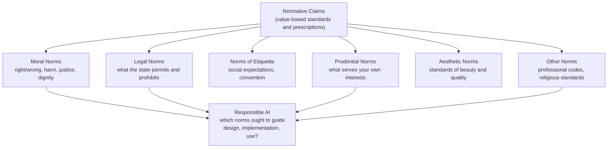

# Normativity and Regulation

## What Is a Normative Claim?

A **normative claim** is a statement whose truth relies on some underlying value standard
or prescription — not just a description of how things are, but a claim about how things
*ought* to be, what is *good* or *bad*, what *should* or *should not* be done.

Examples:
- "This AI system is harmful" — normative
- "This AI system processes 1 billion requests per day" — descriptive
- "This hiring algorithm discriminates unfairly" — normative
- "This hiring algorithm rejects 40% of applicants" — descriptive

**Normative ≠ subjective.** A normative claim is not merely a personal preference or
arbitrary opinion. It references standards — standards of harm, fairness, dignity, justice —
that can be examined, debated, and refined. The standards may be contested. That does not
make them arbitrary.

---

## The Normative Taxonomy

Not all normative claims are the same kind. They draw on different underlying standards:

**One of the consistent failures in AI ethics discourse** is collapsing these categories:
- Treating a **legal norm** (GDPR compliance) as if it satisfies a **moral norm**
  (people's actual privacy interests)
- Treating a **prudential norm** (this is profitable) as if it were a **moral norm**
  (this is good for society)
- Treating an **aesthetic norm** (this model produces impressive outputs) as a proxy
  for a **moral norm** (this model is beneficial)

The categories are related but not interchangeable. Compliance is not ethics.
Profit is not benefit. Impressiveness is not safety.

---

## Contested ≠ Unprovable

The fact that people disagree about a normative claim does not mean the claim is
unanswerable or that all positions are equally valid.

People disagreed about whether the Earth was round. The disagreement did not make
the question unanswerable — it made the answer harder to establish. The same applies
to normative claims.

**The test the course proposes:** Reflect on your own deepest ethical commitments —
the ones that shape how you live and what you refuse to do. Do you think of these as
arbitrary preferences, no more correct than their opposites? If not — if you think
they are actually *right* — then you already believe normative claims can be more than
mere opinion. You are making normative claims and treating them as worth defending.

Proof of normative claims does not require:
- Unanimous agreement
- Mathematical certainty
- The same methods as natural science

It requires: standards that can be articulated, examined, and compared. Evidence that
can be weighed. Reasoning that can be scrutinised. These are demanding but achievable.

---

## The Dismissal Pattern — Is-Ought Gap Weaponization

The most common rhetorical move used to shut down ethical concerns about technology:

> "You can't prove objectively that this technology is harmful.
> Therefore your concern is just a value judgment.
> Therefore it doesn't count as evidence against the technology."

This move has a name: **weaponizing the is-ought gap**. It exploits the genuine
philosophical difficulty of proving normative claims — and converts that difficulty
into permanent permission to ignore them.

**Why it is dishonest:**

First: "you can't prove it's harmful" does not prove it's safe. The burden of proof
argument cuts both ways. If normative uncertainty prevents action on harm concerns,
it equally prevents confident claims that the technology is beneficial.

Second: the people making the "prove it objectively" demand are themselves making
normative claims — "innovation is good," "efficiency is valuable," "growth should
be maximized," "disruption creates net benefit." They simply don't acknowledge them
as such. Their normative framework is invisible to them because it is the unexamined
water they swim in.

Third: this strategy has a documented history of deliberate deployment:

- **Tobacco industry** — "you can't prove cigarettes cause cancer," said for decades
  while funding studies designed to muddy the epistemic waters and delay regulation
- **Fossil fuel industry** — same playbook applied to climate science
- **Facebook** — internal researchers documented harm to teenage mental health;
  the company suppressed findings and publicly questioned the evidence standard
- **AI industry** — safety concerns are met with "we need more research before acting,"
  a position that conveniently delays the regulation that would constrain development

The pattern is not neutral epistemology. It is a specific strategy for converting
normative uncertainty into permanent inaction.

> Normative uncertainty is not a reason to dismiss concern.
> It is a reason to examine the standards behind the concern more carefully.

---

## Case Study — "Efficiency Is Good" as an Invisible Normative Default

The clearest real-world example of a normative claim operating as an invisible default
is the economic consensus of the last 40-50 years:

> **"Efficiency is good."**

This is presented as a neutral economic fact — the foundation of market logic, the
justification for globalisation, automation, and now AI deployment. It is not neutral.
It is a normative claim with a specific history, specific beneficiaries, and specific
costs that are systematically excluded from the accounting.

**What the efficiency framework measures:**
Output per unit of input — where inputs and outputs are things with market prices.

**What the efficiency framework does not measure:**
- Time a parent cannot spend with their child because they work multiple jobs
- The community that dissolves when local industry is offshored to cheaper labour markets
- The ecological system destroyed to reduce production costs
- The health cost of chronic stress in a workforce optimised for productivity
- The cultural knowledge that disappears when traditional practices become economically unviable
- The time poverty of people who are more productive and have less life left over

These are real costs. They don't appear in the efficiency calculation because they
were never assigned a market price. The calculation is not neutral — it was designed
to measure specific things and ignore others. Whoever decided what gets measured
decided whose costs count.

**The 40-50 year arc:**

The shift happened in the late 1970s and early 1980s — Thatcher, Reagan, the Washington
Consensus, the global spread of Chicago School economics. The underlying normative claim:
markets allocate resources more efficiently than states; therefore market liberalisation
produces better outcomes for everyone.

The evidence since:
- Productivity increased substantially — the efficiency claim was true by its own measure
- Wages for the bottom 60% in most Western economies stagnated or declined in real terms
- Wealth concentration accelerated consistently — labour income fell relative to capital
- Social mobility declined in countries that adopted the model most aggressively
- The 2008 financial crisis — the most efficient financial markets in history producing
  a collapse that required massive state intervention to prevent total system failure

The efficiency was real. The distribution of the gains was not what the normative
claim promised. The costs were borne by people who had no say in the normative choice
that produced them.

**Time poverty — the cost that statistics cannot see:**

One of the most significant and least measured costs of the efficiency era is time.
People have less of it. Less time for family, health, community, rest, reflection,
spiritual practice — the things that constitute a life rather than just a career.

GDP goes up. Hours worked goes up. Time available for everything else goes down.
The efficiency framework has no category for this loss — because time not spent
producing has no market price. A society optimised for efficiency produces people
who are productive and depleted. The formation of character, the depth of relationship,
the quality of attention brought to raising children or caring for parents — these
require time that the efficiency framework treats as economic waste.

**The AI continuation:**

"AI will increase efficiency" is the same normative claim in new clothing. It probably
will — by the same narrow measure. The question the efficiency framing systematically
prevents you from asking is:

> Efficient for whom? At what cost? Borne by whom? Decided by whom?

The worker whose job is automated does not experience an efficiency gain. They experience
a cost. That cost does not appear in the productivity statistics that justify the
deployment. The normative framework that defines efficiency as the relevant metric has
already decided whose experience counts — before the conversation about the technology begins.

This is the invisible default operating at full force: the normative choice is made
in the framing, before any specific decision is discussed. By the time someone asks
"should we deploy this AI system?", the answer is already shaped by a prior normative
commitment — that efficiency is the right measure of value — that was never stated,
never examined, and never consented to by the people who will bear the cost.

---

## Prescriptivity — From Norms to Rules

**Prescriptive claims** go one step further than normative ones: they specify what
*should be done* in response to a normative judgment.

- Normative: "This facial recognition system discriminates against dark-skinned faces"
- Prescriptive: "This facial recognition system should not be deployed in criminal justice"

Regulation is prescriptive — it translates normative judgments into enforceable rules.
The question of which norms regulation should express is itself normative. There is no
regulation-free position. The absence of regulation is itself a normative choice —
a choice that the existing distribution of power and harm is acceptable.

---

## The Course's Central Question

> Which norms — and whose underlying values — ought to guide the design,
> implementation, and use of AI systems?

This is the question all previous lessons were clearing the ground for.

Everything before this — the contestedness of "responsible AI," the definitions of
intelligence, the critique of AGI, the PiE model, the excluded perspectives — was
establishing why this question is hard and who is currently answering it (and who isn't).

This lesson provides the vocabulary to engage with it directly:
- What kind of norm is at stake? (moral, legal, prudential, professional?)
- What standards underlie the claim?
- Who is making the normative claim and from what position?
- Whose normative framework is being treated as neutral or default?
- What are the prescriptive consequences — what rules follow from the norm?

---

## Connection to Responsible AI

"Responsible" is a normative concept. When someone says an AI system is or isn't
responsible, they are making a normative claim — referencing standards of responsibility
that can be examined and contested.

The course is now asking: which norms should responsible AI express, and how should
those norms be translated into regulation?

That question cannot be answered by:
- Benchmark performance
- Compliance checklists
- Principles documents that don't name whose values they encode
- The developer's own assessment of their system's safety

It requires: named standards, named values, named tradeoffs, and named accountability
for who bears the cost when the system gets it wrong.

---

## Key Insight

> Normative claims are not just opinions.
> Contested does not mean unprovable.
> "You can't prove it objectively" is not a refutation — it is often a strategy.
>
> The question is not whether normative claims can be made about AI systems.
> They are being made constantly, by everyone involved — including those who
> claim to be making only technical decisions.
> The question is which normative claims are made visible, examined, and held
> to account — and which ones are allowed to operate as invisible defaults.

---

## Connections

- *Topic 01* — "responsible AI" is itself a normative concept; the contestedness
  of the term is a normativity problem
- *Topic 03* — the AGI debate is normative: "AGI is a meaningful goal" is a value claim
- *Concept — Canca/PiE* — the core/instrumental distinction is a normative architecture:
  autonomy, beneficence, justice are the foundational normative standards
- *Concept — Data intimacy* — "this data collection is harmful" is a normative claim
  that the industry has systematically challenged using the dismissal pattern above
- *Concept — Technology and authoritarianism* — "democratic consent matters" is a
  normative commitment, not a technical requirement
