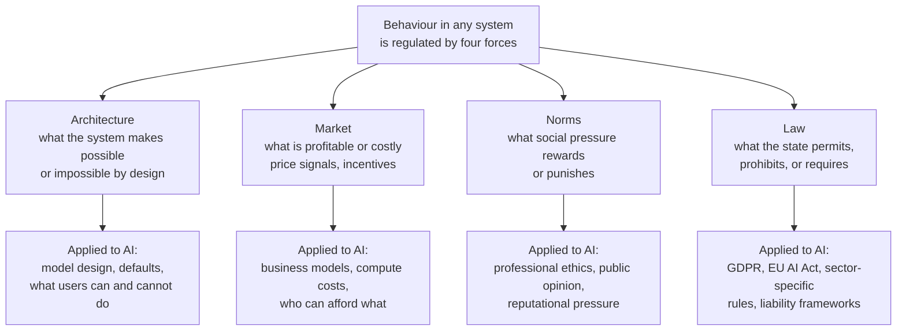

# Why Regulation?

## The Setup

Before asking "what should AI regulation look like?" the course asks a harder prior
question: "why regulate at all?" — and takes the skeptical case seriously before
answering it.

Regulation skeptics are not arguing for recklessness. They are arguing that:
- Government regulation is one tool among several
- It has specific failure modes that need to be acknowledged
- Those failure modes may make it worse than alternatives in specific cases

This is a legitimate position that deserves engagement, not dismissal.

---

## The Four Regulatory Forces — Lessig's Framework

The section ends with the most important point, almost as a footnote:

> "Regulation in the form of laws is just one possible source of regulation.
> Should it, by itself, be the default first resort?"

This points at the diagram: **Architecture · Market · Norms · Law** — four forces
that regulate behaviour simultaneously in any system. This is Lawrence Lessig's
framework from *Code* (1999), one of the most important frameworks for thinking
about how technology gets governed.

**Why this matters:** Most AI governance conversation focuses exclusively on Law.
But Architecture may be the most powerful regulator of all — what a system makes
impossible by design cannot be violated, regardless of what the law says or what
social norms expect. Market forces may be more determinative than law in practice —
if a harmful behaviour is profitable and the fine for it is less than the profit,
the law doesn't regulate, it taxes.

Effective AI governance requires understanding all four forces and how they interact.
Law alone, without corresponding changes in Architecture, Market incentives, and Norms,
produces compliance theatre — the appearance of regulation without the substance.

---

## The Six Doubts — Compressed

The course presents six grounds for regulation skepticism. They reduce to three
root concerns:

### Root Concern 1 — Competence

**Doubt 1: Regulators don't understand what they're regulating.**
Legislators and judges have been visibly uninformed about basic digital systems.
Expecting them to regulate frontier AI competently is a high bar to clear.

**Doubt 4: Regulators can't foresee what they're regulating against.**
The Collingridge Dilemma: when a technology is new enough to regulate effectively,
its effects are unknown. When its effects are known, it is too embedded to regulate
effectively. You're always choosing between regulating in ignorance or regulating
too late.

**Technosocial opacity** (Shannon Vallor's term): the medium and long-term societal
effects of novel technological systems are by definition difficult or impossible to
foresee. Every technology in history has been simultaneously over- and under-estimated
in its effects. Collective prediction has never been reliable.

*The honest response:* this is real. Regulatory competence is a genuine problem.
The answer is not to abandon regulation but to build regulatory capacity — technical
expertise inside government, independent technical advisory bodies, regulatory
sandboxes that allow controlled observation before full deployment.

### Root Concern 2 — Capture

**Doubt 3: Regulators end up serving the regulated, not the public.**
Regulatory capture — the inversion of the regulator-regulatee relationship — happens
through corruption, revolving doors, shared social circles, or ideological alignment.
The result: regulations that protect incumbents rather than the public, dressed as
public interest governance.

**Doubt 6 (partial): Regulations entrench powerful actors.**
Compliance costs fall disproportionately on smaller actors. Large incumbents can
absorb regulatory burden; small competitors cannot. Regulation designed to constrain
powerful actors may end up protecting them from competition while appearing to
hold them accountable.

*The honest response:* also real — and documented extensively in AI governance already.
The EU AI Act was shaped significantly by lobbying from large technology companies.
The "responsible AI" principles published by major AI labs were written by those labs.
Capture is not a hypothetical risk; it is the current state. The answer is structural:
mandatory independent review, cooling-off periods for the revolving door, public
funding for civil society participation in regulatory processes.

### Root Concern 3 — Overreach

**Doubt 2: Regulation has costs.**
Creating regulatory agencies, achieving compliance, and expanding government power
all have real costs — financial, temporal, and in terms of individual and organisational
discretion. These costs need to be weighed against benefits, not assumed away.

**Doubt 5: The precautionary principle can freeze beneficial innovation.**
Strong versions of the precautionary principle — "prove it's safe before deploying" —
would have prevented electrification, aviation, and most lifesaving medical technology
from reaching the public on the timescales they did. Some risk-taking is generative.
The question is which risks, at what scale, with what reversibility.

**Doubt 6 (partial): Unintended consequences.**
Regulations that seem well-targeted often produce effects their designers didn't intend.
Electric vehicle mandates may keep lower-income people in older, more polluting cars
longer. AI regulations crafted for US/EU contexts may drive development to jurisdictions
with fewer protections, producing worse global outcomes.

*The honest response:* costs are real, but so are the costs of non-regulation. The
relevant comparison is not "regulation vs. no harm" but "regulation vs. the harm that
occurs without it." The precautionary principle applies in both directions — caution
about acting and caution about not acting.

---

## The Collingridge Dilemma — Worth Holding Separately

This deserves its own treatment because it applies directly to AI right now:

> When a technology is new: its effects are unknown, so effective regulation is
> hard to design. But intervention is still possible — the technology is not yet embedded.
>
> When a technology is mature: its effects are known, so effective regulation is
> easier to design. But intervention is now much harder — the technology is deeply
> embedded in infrastructure, economy, and daily life.

AI is currently at the transition point — new enough that effects are still uncertain,
mature enough that it is already embedded in consequential decisions (hiring, credit,
healthcare, criminal justice). This is the worst position for regulation: enough
embedding to make intervention costly, not enough track record to know precisely
what to regulate.

The practical implication: waiting for certainty before regulating is itself a choice
with consequences. It is not a neutral position.

---

## What This Means for AI Regulation

The six doubts, taken seriously, produce a set of design requirements for any AI
regulatory framework that wants to avoid the failure modes:

| Failure mode | Design requirement |
|---|---|
| Regulator incompetence | Technical expertise embedded in regulatory bodies; independent technical advisory panels |
| Technosocial opacity | Regulatory sandboxes; iterative review cycles; sunset clauses requiring reauthorisation |
| Regulatory capture | Mandatory independent review; revolving door restrictions; public funding for civil society |
| Entrenchment of incumbents | Proportionate compliance requirements; safe harbours for small actors |
| Overreach costs | Cost-benefit analysis with full accounting; reversibility requirements |
| Unintended consequences | Pilot programmes before full deployment; monitoring requirements post-implementation |

---

## The Efficiency Norm — Regulation's Invisible Opponent

One reason regulation skepticism is so persistent: the dominant normative default
of the last 40-50 years is that market efficiency is the right measure of value.
Within that framework, regulation is always a cost — a friction imposed on the
natural operation of markets.

But "market efficiency is the right measure of value" is itself a normative claim
(see Topic 04). It excludes from its accounting exactly the costs that regulation
is often designed to address: harm to people who have no market power, environmental
costs that have no price, time poverty, community dissolution, cultural loss.

The debate about whether to regulate AI is not a technical debate about optimal
policy design. It is a normative debate about which values the system should serve —
and whose costs count in the accounting.

---

## Key Insight

> The question is not "regulation or no regulation."
> All four forces — Architecture, Market, Norms, Law — are already regulating AI.
> The question is which combination of forces, designed how, serving whose values,
> produces outcomes worth having.
>
> Law alone, without corresponding changes in the other three, produces compliance
> theatre. Architecture alone, without democratic accountability, produces governance
> by whoever controls the design. Market alone produces optimisation for whoever
> has purchasing power. Norms alone are too slow and too uneven.
>
> The task is not to find the one right regulatory instrument.
> It is to understand how the four forces interact — and to intervene deliberately
> across all of them.

---

## Connections

- *Topic 04 — Normativity* — regulation skepticism rests on normative claims
  ("efficiency is good," "government overreach is bad") that are rarely examined
- *Concept — Technology and authoritarianism* — the Collingridge Dilemma explains
  why authoritarian systems can regulate faster: they don't require democratic
  deliberation before acting
- *Concept — Data intimacy and ethics limits* — market regulation of harmful products
  is exactly what the categorical data exclusion argument calls for
- *Canca/PiE* — the four Lessig forces map onto the PiE model's governance layer:
  Architecture = ethics-by-design; Norms = professional training; Law = regulatory
  compliance; Market = incentive design
