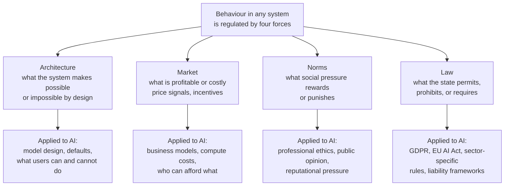

# Why Regulation?

*Personal study notes — original analysis and synthesis based on course themes,
independent research, and discussion. Not a reproduction of course material.*

---

## The Setup

Before asking "what should AI regulation look like?" the course asks a harder prior
question: "why regulate at all?" — and takes the skeptical case seriously before
answering it.

Regulation skeptics are not arguing for recklessness. They are arguing that:
- Government regulation is one tool among several
- It has specific failure modes that need to be acknowledged
- Those failure modes may make it worse than alternatives in specific cases

This is a legitimate position that deserves engagement, not dismissal.

---

## The Four Regulatory Forces — Lessig's Framework

The section ends with the most important point, almost as a footnote:

> "Regulation in the form of laws is just one possible source of regulation.
> Should it, by itself, be the default first resort?"

This points at the diagram: **Architecture · Market · Norms · Law** — four forces
that regulate behaviour simultaneously in any system. This is Lawrence Lessig's
framework from *Code* (1999), one of the most important frameworks for thinking
about how technology gets governed.

**Why this matters:** Most AI governance conversation focuses exclusively on Law.
But Architecture may be the most powerful regulator of all — what a system makes
impossible by design cannot be violated, regardless of what the law says or what
social norms expect. Market forces may be more determinative than law in practice —
if a harmful behaviour is profitable and the fine for it is less than the profit,
the law doesn't regulate, it taxes.

Effective AI governance requires understanding all four forces and how they interact.
Law alone, without corresponding changes in Architecture, Market incentives, and Norms,
produces compliance theatre — the appearance of regulation without the substance.

---

## The Six Doubts — With Responses

Each doubt is legitimate. Each also has a response that doesn't dismiss it but
reframes what follows from it.

---

### Doubt 1 — Regulators Don't Understand What They're Regulating

Legislators and judges have been visibly uninformed about basic digital systems.
Expecting them to regulate frontier AI competently is a high bar to clear.

**Response — Law provides consistency that nothing else reliably does.**
Markets self-regulate poorly and hold themselves accountable rarely. Norms are slow
and uneven. Architecture is often the very thing under discussion. That leaves law
as the reasonable default starting point — not because it's perfect, but because the
alternatives have well-documented failure modes of their own. The answer to regulatory
incompetence is building regulatory capacity, not abandoning regulation.

---

### Doubt 2 — Regulation Has Real Costs

Creating regulatory agencies, achieving compliance, and expanding government power
all have real costs. Compliance burdens fall disproportionately on smaller actors.

**Response — The protections we rely on daily were fought by industry for decades.**
Seatbelts, pharmaceutical testing requirements, building fire codes, food labeling
standards, airplane safety — all of these were opposed tooth and nail by the industries
they now govern. Skepticism about regulation is, in practice, skepticism about public
safety. That is a difficult position to hold when discussing a technology whose
advocates insist its society-wide adoption is inevitable.

---

### Doubt 3 — Regulatory Capture

Regulatory bodies end up captured by those they regulate — through revolving doors,
shared social circles, or ideological alignment. The EU AI Act was shaped significantly
by Big Tech lobbying. "Responsible AI" principles are written by the labs themselves.
Capture is not a hypothetical. It is the current state.

**Response — Capture is an argument for better-designed regulation, not less.**
The structural answer: mandatory independent review, cooling-off periods for revolving
doors, public funding for civil society participation. Capture happens when governance
design allows it. The response is governance design that doesn't.

---

### Doubt 4 — Regulators Can't Foresee What They're Regulating Against

The Collingridge Dilemma: when a technology is new enough to regulate effectively,
its effects are unknown. When its effects are known, it is too embedded to regulate
effectively. Technosocial opacity is real — collective prediction has never been reliable.

**Response — AI's harms are not speculative. They are visible now.**
AI systems as they actually exist are turbocharged versions of already-existing digital
risks — not science fiction. The automation of tasks, inferences from vast data, use of
those inferences in healthcare, education, and criminal justice — these are happening now,
and many are already partially covered by existing regulation. The question is not
"how do we regulate the unknowable future?" but "why wouldn't we apply what already works
to the harms we can already see?" Waiting for certainty is also a choice — with consequences.

---

### Doubt 5 — The Precautionary Principle Can Freeze Innovation

Strong versions of "prove it's safe before deploying" would have delayed electrification,
aviation, and most lifesaving medical technology. Some risk-taking is generative.

**Response — Rules vs. standards. Sandboxes. The binary is false.**

Two important clarifications:

**Rules vs. standards:** Regulation doesn't have to be rigid. A rule says "no moldy
coffee beans." A standard says "up to 6% defects are permissible." Standards give
flexibility and discretion — allowing regulated entities to find their own ingenious
solutions within a framework, rather than being prescribed a single method. The choice
between regulated and innovative is often a false binary.

**Regulatory sandboxes:** Controlled environments where entities and regulators learn
together before full deployment — a lower-stakes version of the proposed regulatory
environment. Like clinical trials for pharmaceuticals: not without problems, but
producing better-informed regulations from more informed regulators. Sandboxes allow
observation of unanticipated uses, risks, and benefits before society-wide adoption.

---

### Doubt 6 — Unintended Consequences

Well-targeted regulations produce effects their designers didn't intend. EV mandates
may keep lower-income people in older, more polluting cars longer. Strict AI regulation
in one jurisdiction may push development to places with fewer protections.

**Response — Imperfect regulation vs. no regulation is still a choice.**
The relevant comparison is not "regulation vs. no harm" — it is "regulation vs. the
harm that occurs without it." The precautionary principle applies in both directions:
caution about acting, and caution about not acting. Unintended consequences are a
reason to design carefully, monitor continuously, and build in revision mechanisms —
not a reason to abandon the project.

---

### Root Concerns — Compressed

The six doubts reduce to three:

| Root concern | Doubts | Structural response |
|---|---|---|
| **Competence** | 1 (understanding), 4 (foresight) | Build regulatory capacity; sandboxes; iterative cycles |
| **Capture** | 3 (allegiance), 6 partial (entrenchment) | Independent review; revolving door restrictions; civil society funding |
| **Overreach** | 2 (costs), 5 (precaution), 6 partial (unintended) | Rules vs. standards; proportionality; monitoring and revision |

---

## The Collingridge Dilemma — Worth Holding Separately

This deserves its own treatment because it applies directly to AI right now:

> When a technology is new: its effects are unknown, so effective regulation is
> hard to design. But intervention is still possible — the technology is not yet embedded.
>
> When a technology is mature: its effects are known, so effective regulation is
> easier to design. But intervention is now much harder — the technology is deeply
> embedded in infrastructure, economy, and daily life.

AI is currently at the transition point — new enough that effects are still uncertain,
mature enough that it is already embedded in consequential decisions (hiring, credit,
healthcare, criminal justice). This is the worst position for regulation: enough
embedding to make intervention costly, not enough track record to know precisely
what to regulate.

The practical implication: waiting for certainty before regulating is itself a choice
with consequences. It is not a neutral position.

---

## What This Means for AI Regulation

The six doubts, taken seriously, produce a set of design requirements for any AI
regulatory framework that wants to avoid the failure modes:

| Failure mode | Design requirement |
|---|---|
| Regulator incompetence | Technical expertise embedded in regulatory bodies; independent technical advisory panels |
| Technosocial opacity | Regulatory sandboxes; iterative review cycles; sunset clauses requiring reauthorisation |
| Regulatory capture | Mandatory independent review; revolving door restrictions; public funding for civil society |
| Entrenchment of incumbents | Proportionate compliance requirements; safe harbours for small actors |
| Overreach costs | Cost-benefit analysis with full accounting; reversibility requirements |
| Unintended consequences | Pilot programmes before full deployment; monitoring requirements post-implementation |

---

## The Efficiency Norm — Regulation's Invisible Opponent

One reason regulation skepticism is so persistent: the dominant normative default
of the last 40-50 years is that market efficiency is the right measure of value.
Within that framework, regulation is always a cost — a friction imposed on the
natural operation of markets.

But "market efficiency is the right measure of value" is itself a normative claim
(see Topic 04). It excludes from its accounting exactly the costs that regulation
is often designed to address: harm to people who have no market power, environmental
costs that have no price, time poverty, community dissolution, cultural loss.

The debate about whether to regulate AI is not a technical debate about optimal
policy design. It is a normative debate about which values the system should serve —
and whose costs count in the accounting.

---

## Key Insight

> The question is not "regulation or no regulation."
> All four forces — Architecture, Market, Norms, Law — are already regulating AI.
> The question is which combination of forces, designed how, serving whose values,
> produces outcomes worth having.
>
> Law alone, without corresponding changes in the other three, produces compliance
> theatre. Architecture alone, without democratic accountability, produces governance
> by whoever controls the design. Market alone produces optimisation for whoever
> has purchasing power. Norms alone are too slow and too uneven.
>
> The task is not to find the one right regulatory instrument.
> It is to understand how the four forces interact — and to intervene deliberately
> across all of them.

---

## Connections

- *Topic 04 — Normativity* — regulation skepticism rests on normative claims
  ("efficiency is good," "government overreach is bad") that are rarely examined
- *Concept — Technology and authoritarianism* — the Collingridge Dilemma explains
  why authoritarian systems can regulate faster: they don't require democratic
  deliberation before acting
- *Concept — Data intimacy and ethics limits* — market regulation of harmful products
  is exactly what the categorical data exclusion argument calls for
- *Canca/PiE* — the four Lessig forces map onto the PiE model's governance layer:
  Architecture = ethics-by-design; Norms = professional training; Law = regulatory
  compliance; Market = incentive design
