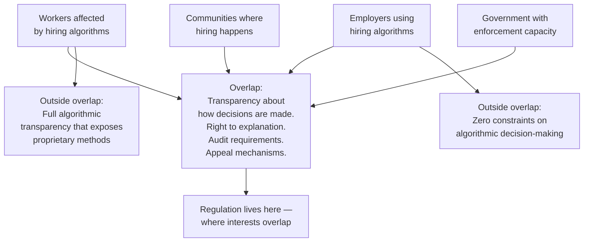

# Operationalisation and the Venn Diagram

_Personal study notes — original analysis and synthesis. Not a reproduction of course material._

---

## The Operationalisation Problem

Regulation requires more than good intentions. It requires:

- **Quantification** — expressing values in numerical terms where possible
- **Operationalisation** — defining values in terms of actions and operations,
  not just feelings or principles

A law that says "hiring algorithms must be fair" is unenforceable unless "fair" is
defined precisely enough that a developer knows whether they have complied, and an
auditor knows whether to flag a violation.

This is genuinely hard. Many things we value resist quantification. Fairness, dignity,
autonomy, wellbeing — these are not easily expressed as numbers without losing something
essential in the translation.

But the alternative — vague standards that nobody can comply with or enforce — is not
better. A law against selling tobacco to someone who "looks like a jerk" is worse than
no law at all. It gives arbitrary power to whoever decides what "jerk" means. Clarity
is not optional. It is a basic requirement of a just rule.

---

## Why Perfect Objectivity Is the Wrong Goal

The standard response to the operationalisation problem is to search for an objective
definition — one that everyone would agree is correct. But this search is impossible
for a specific reason: **values genuinely conflict**.

Different people have different interests. Those interests are not always compatible.
A fairness definition that benefits one group may disadvantage another. A privacy
standard that protects individuals may impede public health research. An accuracy
requirement that helps one demographic may harm another.

This is not a failure of reasoning. It is the actual condition of pluralistic societies.
Anyone promising a regulation that satisfies everyone is either:

- Naive about the depth of value conflict
- Selling something — specifically the illusion of consensus that serves their interests

Perfect objectivity is not achievable. Pretending it is produces regulations that look
neutral but encode the values of whoever got to define "objective."

---

## The Venn Diagram — The Honest Resolution

The honest and practical alternative:

> **Draw the biggest possible Venn diagram of overlapping reasonable interests.**
> Legislate inside that overlap. Name what is outside it. Build mechanisms to expand it.

Not perfect. Not universal. But maximally inclusive given real constraints.

The overlap is not everything anyone wants. It is what most people across most positions
can accept as a reasonable constraint. It is the starting point — not the destination.

---

## What the Venn Diagram Does That "Objective Fairness" Cannot

**It acknowledges pluralism honestly.**
Different people have different values. That is not a bug to fix — it is the actual
condition you are legislating for. The Venn diagram accepts this and works with it
rather than pretending it away.

**It makes the excluded visible.**
When you draw the biggest possible overlap, the people outside it become nameable.
You can ask: who did we fail to include? Why? What would it take to bring them in?
That is a better question than "is this objectively fair?" — which has no answer.

**It shifts the burden to inclusion, not perfection.**
The question becomes: "did you try to include the maximum number of affected
perspectives?" — demanding but achievable. Rather than: "is this perfectly fair?" —
impossible and unanswerable.

**It maps directly onto the excluded perspectives problem.**
AI governance produces rules that miss not because perfect fairness is unattainable,
but because the Venn diagram drawn is too small. It only includes the perspectives of
people in the room. The fix is not a better definition of fairness. It is a bigger room.

---

## The Tobacco Age Example — The Venn Diagram Working

"Don't sell tobacco products to a six year old."

This law is clear and enforceable because it sits inside a near-universal overlap.
Across cultures, political positions, religious traditions, and values systems —
almost nobody thinks selling tobacco to a child is acceptable. The Venn diagram
is near-total. The law writes itself.

The hard cases in AI regulation are hard precisely because the overlap is smaller
and more genuinely contested. The response is not to abandon regulation. It is to:

1. Be honest about the size of the overlap achieved
2. Name clearly what is outside it and why
3. Build revision mechanisms that can expand the overlap as understanding grows

---

## Rules vs. Standards — The Venn Diagram Over Time

The rules vs. standards distinction from Topic 05 fits here precisely.

A **rule** assumes the Venn diagram is complete — you know exactly what you want
and can specify it precisely. Appropriate when the overlap is near-universal and stable.

A **standard** acknowledges the Venn diagram is still being drawn — you know the
direction but not the precise boundary. Appropriate when:

- The technology is new and effects are still being understood
- The affected communities have not all been heard from yet
- The values in tension have not been fully mapped

Starting with standards and tightening toward rules as the overlap clarifies is
more honest than starting with rules that pretend to a precision they don't have.

---

## What This Means for AI Regulation Specifically

**Fairness in hiring algorithms:**
The overlap across employers, workers, and communities likely includes:

- Transparency about what factors are used
- The right to explanation when a decision is made
- Audit requirements by independent bodies
- Appeal mechanisms

It probably does not yet include a single agreed numerical definition of "fair" —
because the measurement of fairness is itself contested in ways that require more
deliberation. Start with the overlap. Build toward precision.

**Data collection:**
The overlap likely includes:

- Minimum necessary data for declared purpose
- No collection without meaningful notice
- Right to access and deletion

It probably does not include a single global standard for data use — contexts differ
too much. But the overlap above is achievable now.

**Algorithmic accountability:**
The overlap likely includes:

- Disclosure that an algorithm was used in a consequential decision
- Human review available for high-stakes decisions
- Liability for documented harm

It probably does not include full algorithmic transparency — the tension with
proprietary interests is real. But accountability for outcomes is inside the overlap.

---

## The Regulatory Bodies Question

The course raises how regulatory authority should be structured — single agency vs.
distributed, who sets policy vs. who sets standards vs. who enforces.

The Venn diagram framework suggests one principle for that structure:

> **The people drawing the Venn diagram should represent the people affected by it.**

A Ministry of AI Regulation staffed entirely by technologists and lawyers from the
industry it regulates will draw a small Venn diagram centred on industry interests —
regardless of how well-intentioned they are. The structure of the room determines
the size of the overlap that gets identified.

Independent standards bodies. Civil society representation with decision-making power.
Affected community input at the point where decisions are still open. These are not
nice-to-haves. They are the mechanism by which the Venn diagram gets drawn honestly.

---

## Key Insight

> Perfect fairness is not the goal. It is not achievable.
> The goal is the largest honest overlap between the most affected perspectives —
> drawn by the people who actually live with the consequences,
> stated clearly enough to comply with and enforce,
> with revision mechanisms that expand the overlap over time.
>
> The tobacco age law exists because almost everyone agrees.
> AI regulation is hard because the room where agreement is sought
> is too small, too insulated, and too unrepresentative
> of the people who will live under whatever it produces.
>
> Make the room bigger. Draw the diagram honestly.
> That is not a perfect solution. It is the only honest one.

---

## Connections

- _Topic 04 — Normativity_ — operationalisation is the practical problem that
  normative contestedness produces; the Venn diagram is how you work with it
- _Topic 05 — Regulation_ — rules vs. standards distinction; regulatory sandboxes
  as mechanisms for expanding the Venn diagram over time
- _Concept — Excluded perspectives_ — the room determines the diagram;
  small room = small overlap = rules that miss
- _Concept — Ethics as defanging_ — "objective fairness" language is used the
  same way "ethical AI" is — to create the appearance of resolution without the
  substance of inclusion
