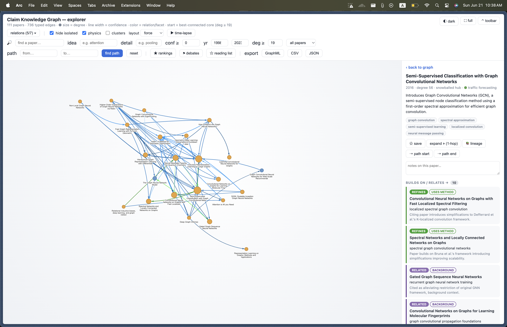
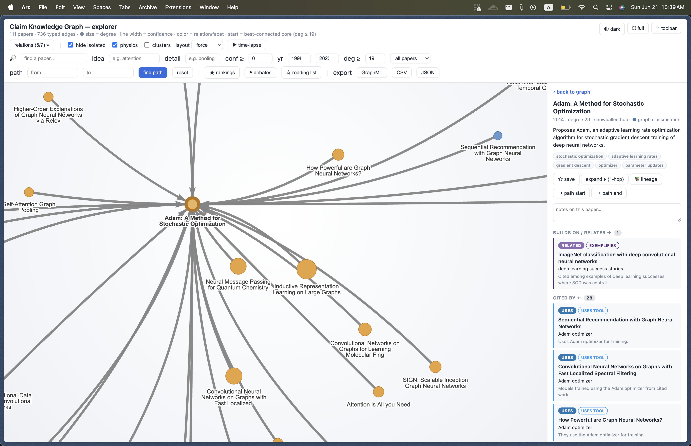
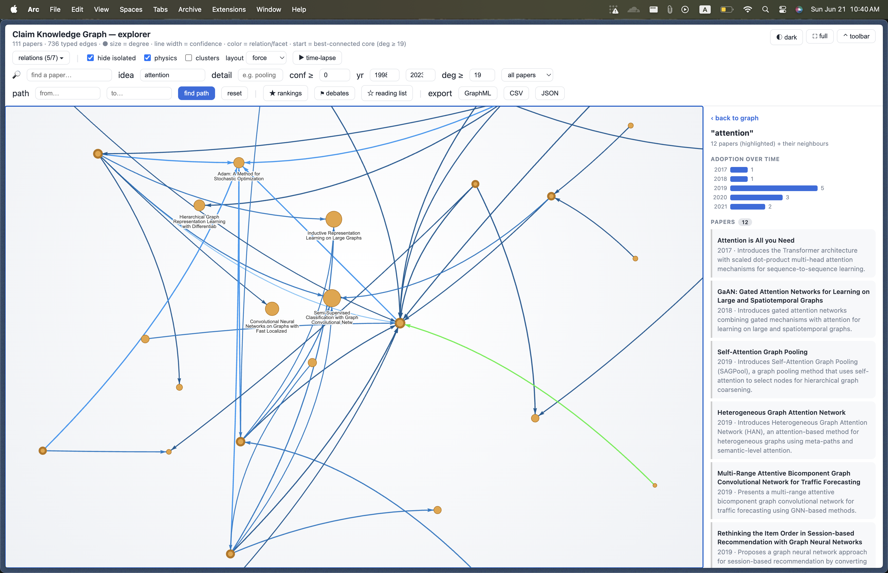

# Claim Knowledge Graph

A vertical slice of the knowledge-infrastructure vision: **papers in → typed citation
graph → an explorer for finding ideas, gaps, and lineage.** Real papers, real provenance,
honest evaluation.

```
ingest (OpenAlex/S2)  →  classify + type edges (Claude)  →  graph (Kùzu)  →  explore (HTML)
   src/ingestion              src/extraction, src/graph        src/graph        src/graph/visualize
```

## Run it

```bash
source ../.venv/bin/activate           # venv lives at ai/responsible-ai/.venv

# 1. Ingest real papers (OpenAlex, open API) -> sentences with provenance
python -m src.ingestion --query "graph neural networks" --limit 50

# 2. Build the claim graph (classify -> embed -> Kùzu nodes -> typed edges)
python -m src.graph.build                 # --tagger llm (default; needs ANTHROPIC_API_KEY)

# 3. Query, or explore visually
python -m src.query "graph neural networks for recommendation"
python -m src.graph.visualize             # -> graph.html ; then: open graph.html
```

Offline, no API: `python -m src.extraction.train` then `python -m src.graph.build --tagger distilbert`.

## Layers

| Layer | Module | What it does |
| ----- | ------ | ------------ |
| Ingest | `src/ingestion` | OpenAlex/Semantic Scholar → sentences with `(paper_id, section, char offset)` provenance; citation snowball to densify the corpus. Caches API responses. |
| Extract | `src/extraction` | Claim tagger behind one `.tag()` interface: an **LLM tagger** (Claude, default) and an offline **DistilBERT** fallback. `eval_ood.py` is the honest head-to-head. |
| Edges | `src/graph` | Citation linking → **citance-context LLM typer** into a faceted taxonomy (umbrella relation USES/REFINES/SUPPORTS/CONTRADICTS/ADDRESSES_SAME_PROBLEM/RELATED + filterable facets). Per-paper cards (summary + idea tags) and a canonical idea vocabulary. |
| Explore | `src/graph/visualize` | Standalone `graph.html` (vis-network). |

Storage is **Kùzu** (embedded property graph, Cypher, no server). Bulk LLM calls default to
`claude-haiku-4-5`; evals use `claude-opus-4-8`.

## Graph explorer

`python -m src.graph.visualize` regenerates `graph.html` from `data/processed/`. Features:

- **Tree filter** — relations as umbrellas with expandable facet children; color = relation/facet, edge width = confidence, node size = degree.
- **Paper cards** — click a node for its one-line contribution summary + idea chips; cards and neighbours are clickable to walk the graph.
- **Idea filter** — canonical concept search with a per-idea adoption-over-time chart.
- **Field map** — community detection, clusters labelled by distinctive idea.
- **Time-lapse** — replay the corpus chronologically. Plus rankings, debates, shortest-path, lineage, reading list (localStorage), GraphML/CSV/JSON export.





## Status

End-to-end on real papers: **111 papers, 736 typed citation edges** in the explorer. See
`plan.md` for tickets, `agents/shared/` for findings/decisions, `CHANGELOG.md` for history.

**Honest limitations.** Claim extraction is solved for CS via the LLM tagger (OOD macro-F1
0.571 → 1.000 vs DistilBERT) but the eval set is small (n=33). The corpus is
similarity-clustered, so RELATED dominates — USES/REFINES density comes from corpus
construction, not better typing. Abstracts + citances only; full-text is future work. This
is a *slice*, with gaps named rather than hidden.
