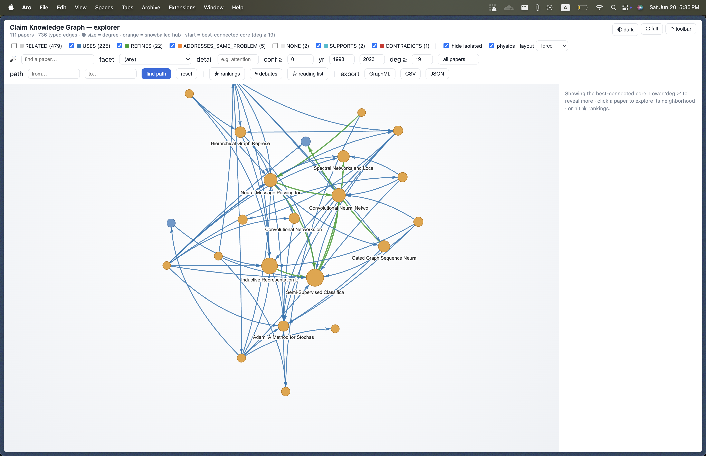

# Claim Knowledge Graph

A vertical slice of the knowledge-infrastructure vision: **papers in → claims as nodes →
typed edges → queryable.** Real papers, real provenance, honest evaluation.

```
ingest (OpenAlex)  →  classify (CLAIM/METHOD/BACKGROUND)  →  embed + graph (Kùzu)  →  query
   src/ingestion          src/extraction                       src/graph              src/query
```

## Run it

```bash
source ../.venv/bin/activate           # venv lives at ai/responsible-ai/.venv

# 1. Ingest real papers (OpenAlex, open API) -> sentences with provenance
python -m src.ingestion --query "graph neural networks" --limit 50

# 2. Build the claim graph (classify -> embed -> Kùzu nodes -> NLI-typed edges)
#    Default tagger is the Claude LLM (needs ANTHROPIC_API_KEY); see step 2b for the
#    offline DistilBERT alternative.
python -m src.graph.build                 # --tagger llm (default)

# 3. Query
python -m src.query "graph neural networks for recommendation"
```

### Offline / no-API alternative

```bash
# 2a. (one-time) train the DistilBERT claim classifier on PubMed-RCT
python -m src.extraction.train
# 2b. build with the offline tagger (no API calls, lower accuracy on CS text)
python -m src.graph.build --tagger distilbert
```

## Layers

| Layer | Module | What it does |
| ----- | ------ | ------------ |
| Ingest | `src/ingestion` | OpenAlex search → abstract reconstruction → sentence segmentation with `(paper_id, section, char offsets)` provenance. Caches API responses. |
| Extract | `src/extraction` | Two interchangeable taggers behind one `.tag()` interface: an **LLM tagger** (Claude, default — domain-general) and a **DistilBERT** tagger fine-tuned on PubMed-RCT (offline fallback). `eval_ood.py` runs the honest head-to-head on hand-labeled CS sentences. |
| Graph | `src/graph` | CLAIM sentences → MiniLM embeddings → Kùzu `Claim`/`Paper` nodes with provenance → candidate pairs by cosine similarity → NLI-typed edges (SUPPORTS / CONTRADICTS / RELATED). |
| Query | `src/query` | Embed a query, rank claims by similarity, return each with source paper + supporting/contradicting claims. |

Storage is **Kùzu** (embedded property graph, Cypher, no server).

## Status (2026-06-14)

End-to-end working on real papers. Current graph (LLM tagger): **41 papers, 123 claims,
247 typed edges**. A query returns claims, their sources, and related claims. See
`plan.md` for tickets and `agents/shared/` for findings/decisions.

### Honest limitations

- **Claim extraction: solved for CS via the LLM tagger.** OOD macro-F1 went 0.571
  (DistilBERT, biomedical-trained) → 1.000 (Claude) on the hand-labeled CS set. Caveat:
  small eval (n=33) with shared labeler/rubric judgment — an independent ~100-sentence
  eval is needed to trust the exact number. DistilBERT stays as the offline fallback.
- **NLI edge typing is now the weak layer.** The general-domain NLI model mislabels
  "two papers each proposing a different method" as `CONTRADICTS`. Scores are stored so
  edges can be filtered; the clear next upgrade is to apply the same LLM approach to edge
  typing that R-003 applied to extraction.
- **Abstracts only** — full-text ingestion is future work.

This is a *slice*, not a product: one honest path through all four layers, with the gaps
named rather than hidden.

## Graph Explorer


