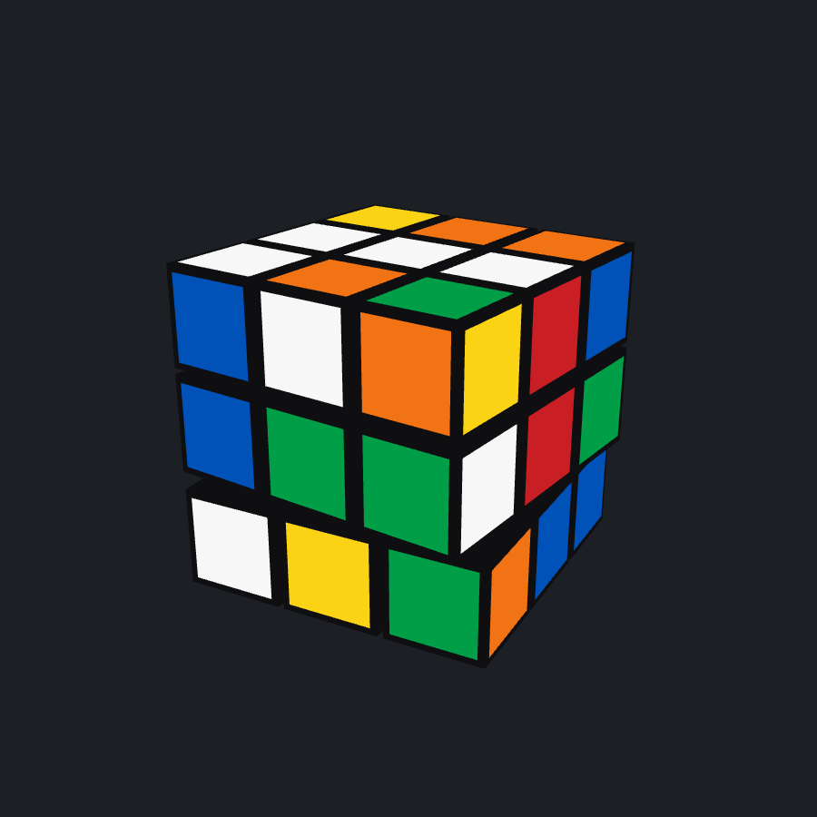

# Rubik's Cube

An interactive 3D Rubik's Cube in Python — OpenGL through pygame, no engine.



## Run

```bash
python3 -m venv .venv
source .venv/bin/activate
pip install -r requirements.txt
python cube.py
```

## Controls

| Input                 | Effect                                      |
| --------------------- | ------------------------------------------- |
| drag the background   | orbit the view                              |
| drag a sticker        | turn that face in the direction you dragged |
| `U` `D` `L` `R` `F` `B` | turn a face (hold Shift for counter-clockwise) |
| `S`                   | scramble (25 random quarter turns)          |
| `Enter`               | solve                                       |
| scroll                | zoom                                        |
| `V`                   | reset the view                              |
| `Esc`                 | quit                                        |

## How it works

Each of the 26 visible cubies carries a grid position on `-1..1` and a 3x3
orientation matrix. Its sticker colours are fixed in its own local frame at
construction and never change — turning a face left-multiplies the position and
orientation of that layer's nine cubies by a 90-degree rotation and re-rounds
the position back onto the integer grid, so the colours follow for free.

Turns are queued and animated one at a time; the state only commits when a turn
finishes, so a half-played turn can never leave the cube in an illegal state.

Dragging a sticker casts a ray from the cursor into cube space, intersects the
cubie boxes, and takes the nearest face. The drag direction is compared against
the screen projection of the face's two in-plane axes; the better match `m`
gives the turn, rotating about `m × n` (which sends the grabbed sticker along
`m`) at the grabbed cubie's layer.

`Enter` replays the inverse of the recorded move history rather than solving
from the current state — exact, dependency-free, and legible on screen. A real
solver would be needed for a cube scrambled by hand rather than by `S`; see
`agents/shared/decisions.md`.
