# Medicine

Tinkering with medical things for the fun of it, really ... yep.

## Spine Crack

https://app.netlify.com/projects/boisterous-fairy-96d8a3/overview

<img width="1728" height="1117" alt="image" src="https://github.com/user-attachments/assets/037aa6aa-75cf-4d98-bf0e-156fc05a079c" /

## ApoB & The Cardiometabolic Cascade

https://glittering-fenglisu-5327a6.netlify.app/

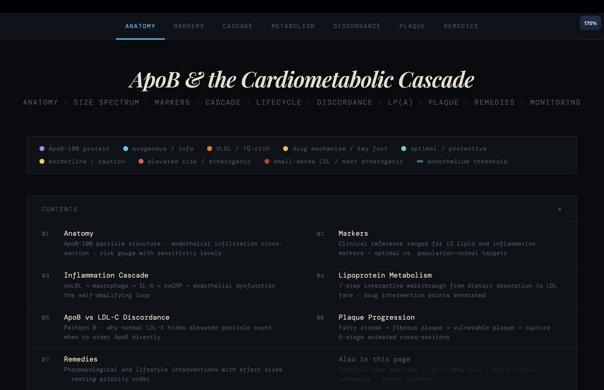
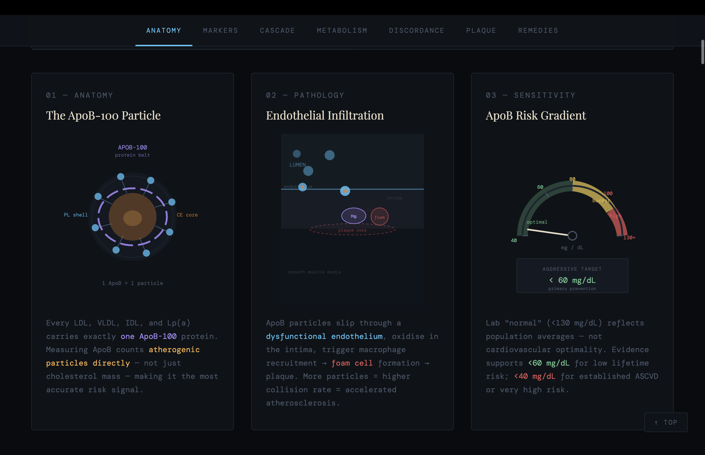
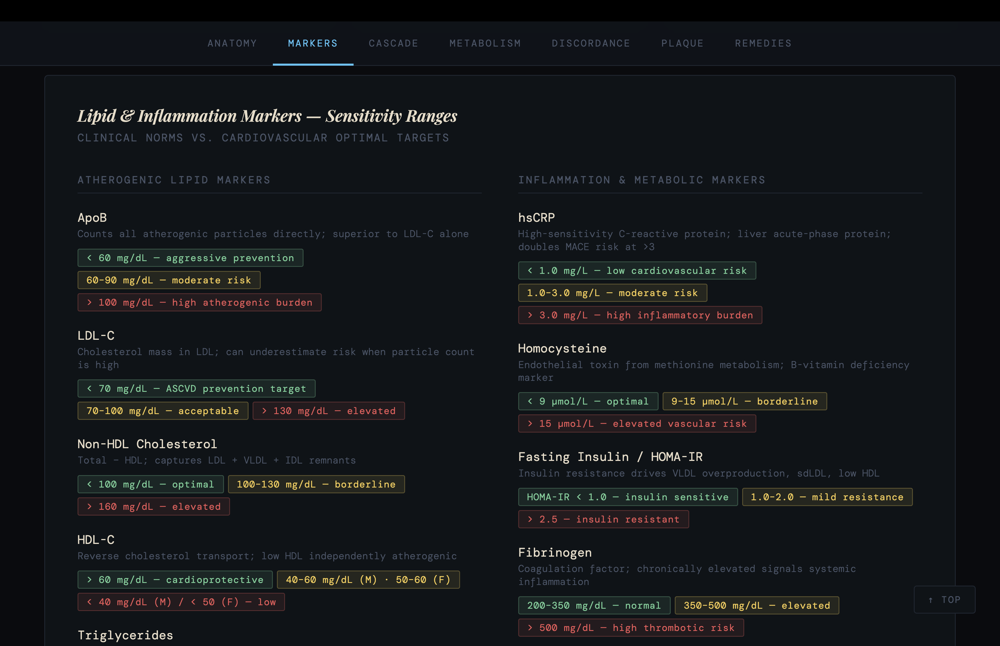
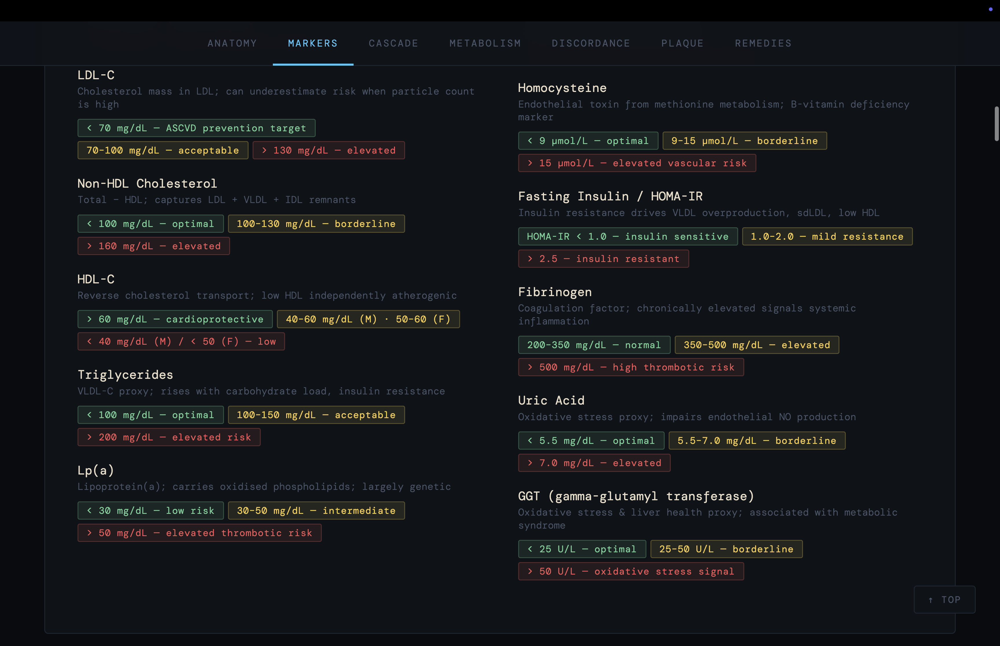
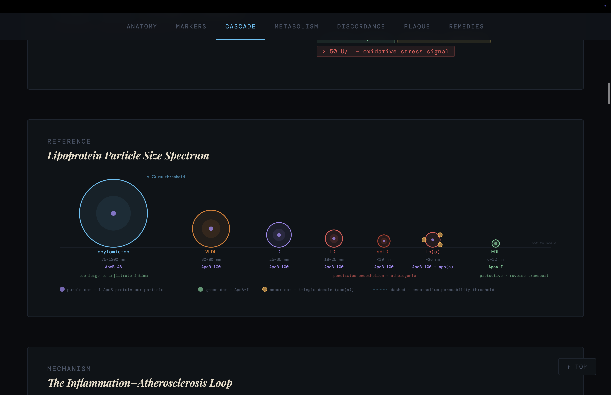
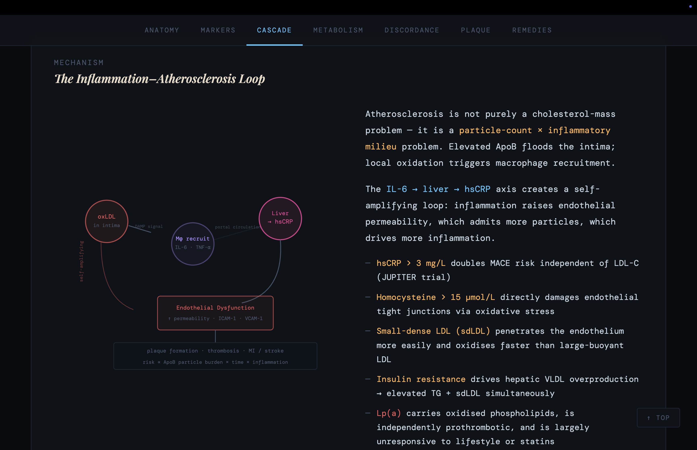
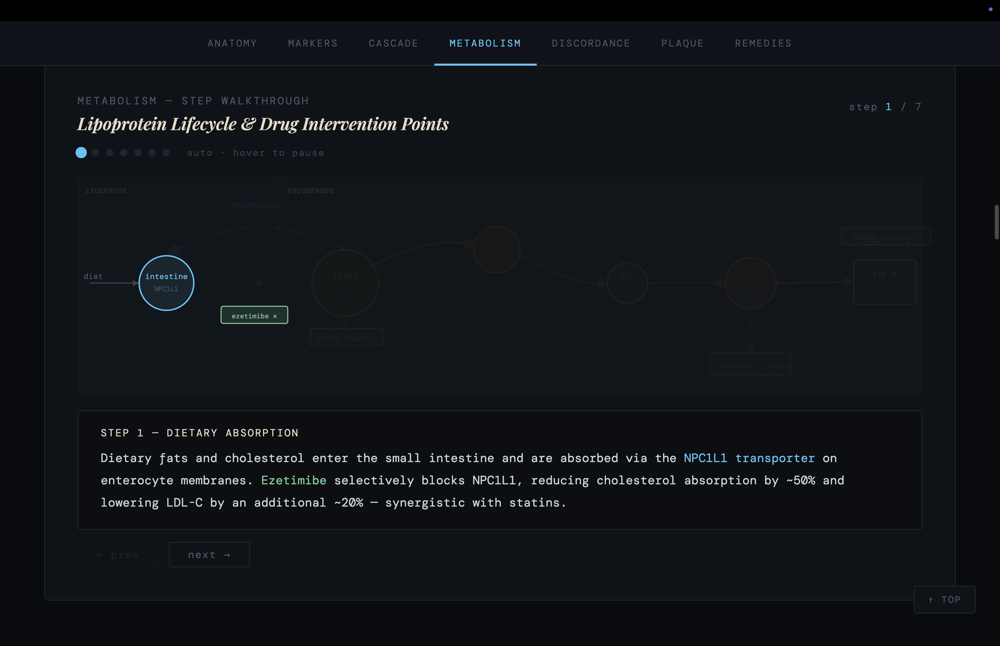
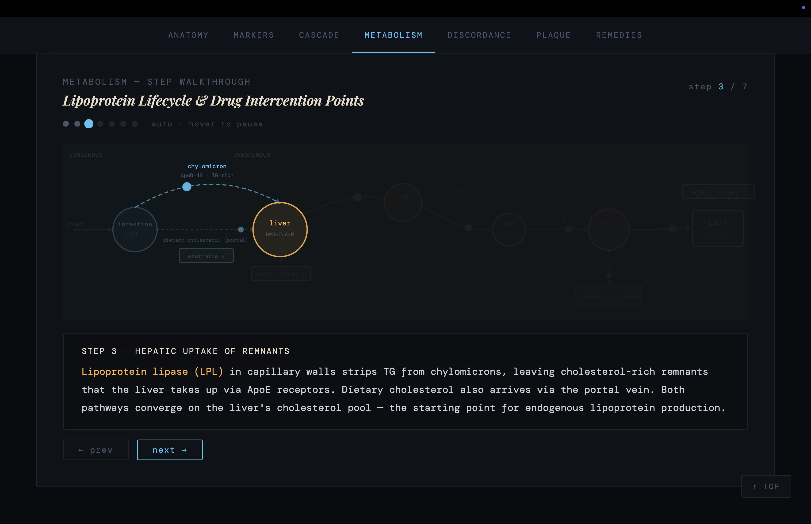
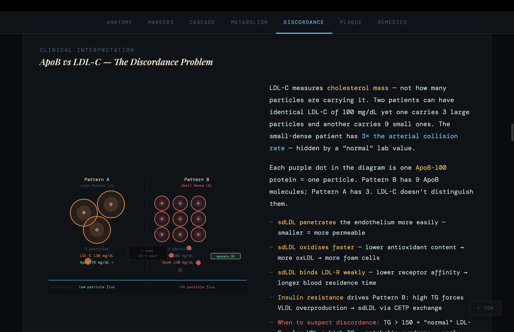
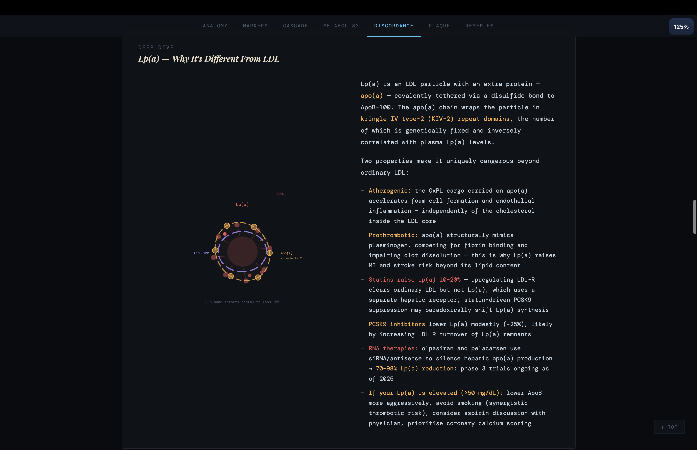
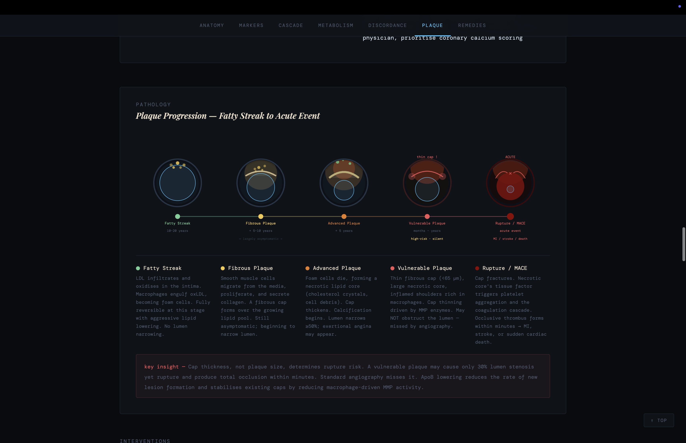
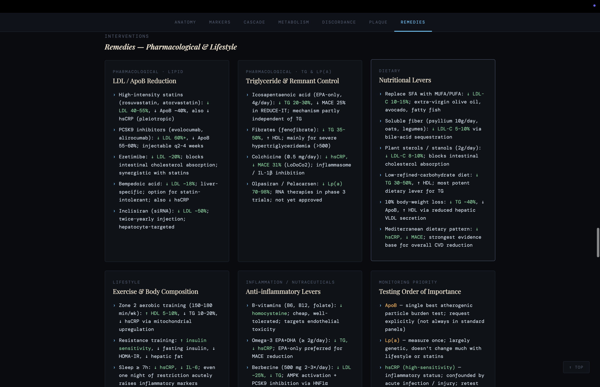
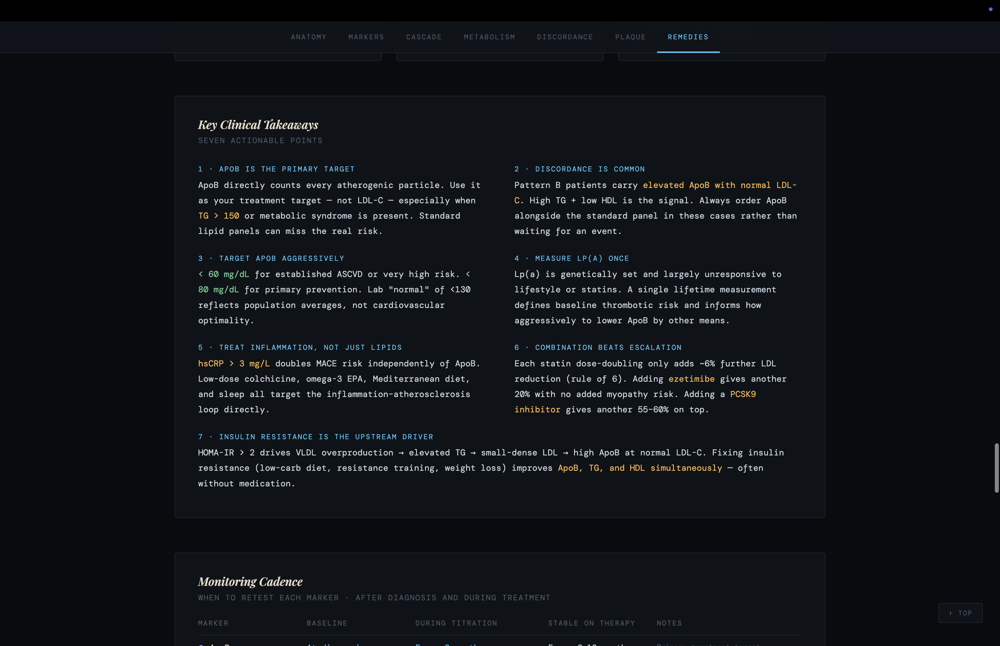
