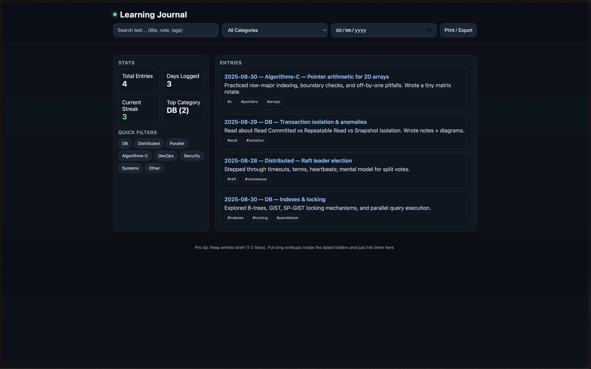
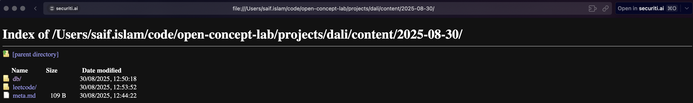

# Dali

A dashboard for me track my learning habits.

Contains a single `index.html` file, and a content directory.

The content directory has further sub-folders based on the date.

The date folders have further folders based on the topic learned that day.

No blog setup -- just an HTML file with manual updates.
